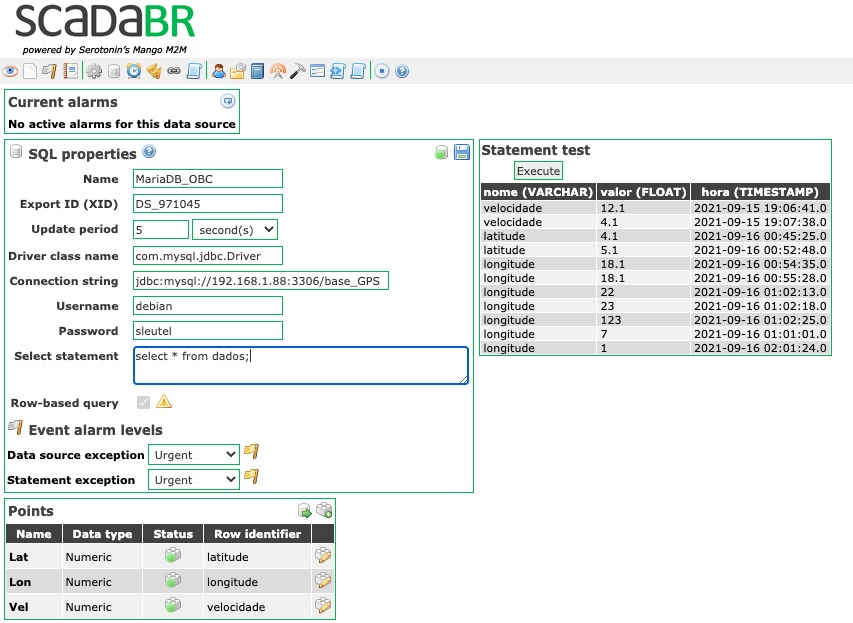
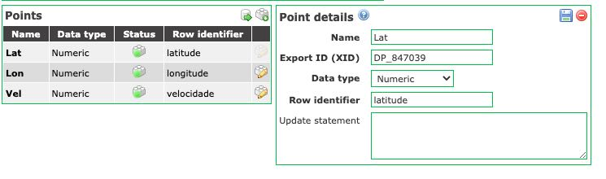
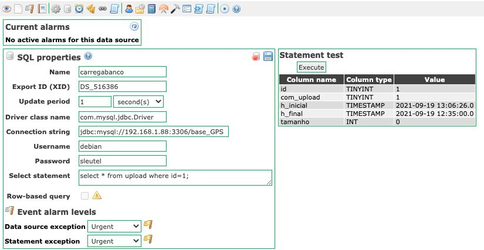
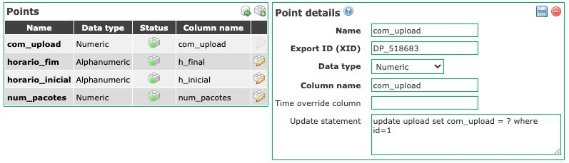
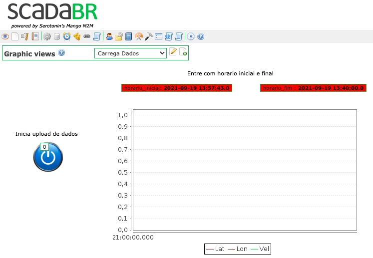

# Data logger pocket beagle - raspberry para ScadaBR

link local `Documentos/GitHub/Computador-de-bordo/Datalogger_Scada`

Este tutorial mostra o passo a passo para criar um datalogger no Pocket Beagle que permite que a gente guarda dados do GPS (coordenados e velocidade), dados do funcionamento do carro (Velocidade linear, corrente e tensão elétrica) num banco de dados no Beagle, e permite depois descarregar todos estes dados de forma automático no ScadaBR ou num outro ambiente de analisar os dados off-line, como por exemplo Octave ou Jupyter. 


* Operação on-line usando ScadaBR
* Operação off-line (armazenando num banco local) usando Jupyter Notebook

Para resolver isso, escolheu-se programar o OBC de modo a também fazer o seu registro de dados num banco de dados locais, e permitir fazer o upload dos dados no ScadaBR, assim que o veículo estiver no alcance da rede local.

Neste sentido, escolheu se para o banco de dados usar o MySQL no OBC e usar o protocolo SQL do ScadaBR. 

# 1. Operação on-line usando ScadaBR

A primeira versão deste trabalho focou somente no ScadaBR como ambiente, mas agora vamos separar o uso do ScadaBR somente para situações de análise on-line usando os protocolos já embarcados no ScadaBR. 

O ScadaBR já permite várias formas de puxar os dados do Computado de Bordo ou OBC implementado pelo Pocket Beagle, usando os protocolos MODBUS-RTU, MODBUS-IP ou HTTP Reciever.

Cada uma desses protocolos tem suas vantagens e desvantagens e conseguimos bons resultados com MODBUS-IP quando usamos uma rede local ou WiFi entre o servidor ScadaBR e o OBC. 

Quando o servidor e o OBC não estão na mesma subrede, o protocolo HTTP Reciever funcionou, entretanto, o tempo de processamento e  transmissão fica em torno de alguns segundos. Isso, torna este protocolo não muito apropriado para operações de uma tempo de amostragem de 1 Hz como é no caso do monitoramento do veículo. 

Escolheu-se 1 Hz por ser também a taxa de envio do bloco de dados do GPS pelo protocolo NMEA. 


Procurou-se neste desenvolvimento aproveitar ao máximo as funcionalidades já presentes no ScadaBR e o Linux, reduzindo o desenvolvimento de programas específicos ao mínimo possível.
 


# 2. Configuração do MariaBD no Beagle

O banco de dados escolhido foi o MariaDB que é uma versão compatível com MySQL. 

[Baseado neste tutorial 1](https://r00t4bl3.com/post/how-to-install-mariadb-server-on-debian-10-buster)

```
$ sudo apt-get install mariadb-server
```

Passei um dia brigando com a instalação do MariaDB no Beagle e no Raspberry, pois estava dando de erro na hora de baixar os arquivos. 

Depois de uma noite de sono eu tentei de novo, mas antes eu só fiz a 

```
$ sudo apt update
```
e funcionou.

Eu nao arrisquei de fazer depois o `upgrade` pois isso eu já tinha feito no dia anterior e não tinha dado sucesso. 
Deve ter alguma coisa específica na instalação do MariaBD, pois outros aplicativos instalavam normalmente usando o `apt-get`

Depois da instalação eu usei o seguinte script para fazer a configuração 

```
$ sudo mysql_secure_installation 
```

## 2.1. Criando o primeiro acesso no MariaDB

[Baseado neste tutoria 2](https://phoenixnap.com/kb/how-to-create-mariadb-user-grant-privileges)


Apos instalado o MariaDB ainda tem uma confusão de como entrar. `mysql -u root -p` nao funcionou.

Consegui somente com `sudo mysql -u root`


## 2.2. Criando usuário 

```
> create user 'debian'@localhost identified by 'sleutel';
> select user from mysql.user;
> grant all privileges on *.* to 'debian'@localhost identified by 'sleutel';
> flush privileges;
> SHOW GRANTS FOR 'debian'@localhost;
```


## 2.3. Alimentando a base de dados
Agora pode entrar com usuario normal 
 
```
debian@beaglebone:~/src$ mysql -p
```

Depois de entrar no ambiente pode se criar a base de dados e abri-lo para uso.

```
> create database base_GPS;
> show databases;
> use base_GPS;
```


### 2.3.1. Opção para Jupyter Notebook
Cada leitura do GPS fornece os dados do relógio do próprio GPS, os coordenados geograficos e a velocidade de deslocamento. 
A leitura é atualizada a cada segundo pelo GPS. Pode-ser que os dados do GPS não são válidos, pois não há visibilidade do GPS fazer o processamento. Neste caso o dados não deve ser gravado no banco.


Pode-se criar uma tabela que tem como o proprio *datestamp* como indice e três campos (latitude, longitude e velocidade).   

```
MariaDB [base_GPS]> create table  registro_GPS (hora timestamp, latitude float, longitude float, velocidade float); 
MariaDB [base_GPS]> insert into registro_GPS values ( now(), 1549.66900 , 04803.60211 , 1.32);
MariaDB [base_GPS]> select * from registro_GPS;
+---------------------+----------+-----------+------------+
| hora                | latitude | longitude | velocidade |
+---------------------+----------+-----------+------------+
| 2022-02-16 01:38:30 |  1549.67 |    4803.6 |       1.32 |
+---------------------+----------+-----------+------------+

```

Ainda falta nessa configuração pegar o timestamp do GPS em vez da hora do sistema operacional. 

Também foinecessário usar em vez de `timestamp` simples a opção com `timestamp(3)` para poder regustrar décimos de segundos. 

### 2.3.2. Opção para ScadaBR (obsoleto) 
O próximo passo é a criação da tabela com os dados monitorados pelo OBC. 
Depois de varias tentativas pesquisando a melhor opção de fazer a integração entre MariaDB e ScadaBR chegamos a seguinte configuração.


```
> create table dados (nome VARCHAR(100), valor float, hora timestamp);
> insert into dados values ("velocidade", 12.1,  now());
> insert into dados values ("latitude", 4.1,  now());
> select * from dados;
```

A tabela de `dados` tem a seguinte estrutura e permitiu a integração direta com o SQL do ScadaBR, buscando de forma automático as variáveis, os valore e o horário que foi medido.

| nome       | valor | hora                |
|------------|-------|---------------------|
| velocidade |  12.1 | 2021-09-15 19:06:41 |
| latitude   |   4.1 | 2021-09-16 00:45:25 |

Para chegar a essa forma gastamos pelo menos uns 3 dias, tentando entender a lógica da construção do banco de dados do ScadaBR e como a busca era feita pelo SQL. 

Algumas coisas que descobrimos é que esse formato só funciona se os valores medidos estão em ordem cronológico de tempo na tabela. O ScadaBR varre os registros pegando a variavel declarada no campo `nome` e armazena o valor com o `timestamp` que está no campo `hora`.

Se ele encontra um registro com uma `hora` anterior que a hora lido no registr anterior, o ScadaBR termine a varredura e ignora o registro novo. 

Mais detalhes da configuração do ScadaBR para fazer essa varredura e upload dos dados está no item 4.


## 2.4. Configurando acesso remoto no Beagle
Uma vez definido o banco de dados e sua estrutura o próximo passo é permitir o acesso ao banco.

A primeira tentativa de acesso remoto fiz com o programa [DBEAVER](https://dbeaver.io) e ao colocar os dados do 
server, username e password não houve nenhuma resposta do MariaBD. 

Fiz algumas modificações 
[baseado neste tutorial 3](https://leandroramos.debxp.org/configurando-o-mariadb-server-para-acesso-remoto-debian-e-ubuntu/).

No arquivo `/etc/mysql/mariadb.conf.d/50-server.cnf` alterou o bind-address de `127.0.0.1` para `0.0.0.0`

Depois de alterado reinicia MariaDB com ` sudo systemctl restart mariadb`

Mesmo assim quando faço o acesso remoto usando, por exemplo Dbeaver recebo a seguinte mensagem de erro 

```
Could not connect to HostAddress{host='192.168.1.88', port=3306, type='master'}. Host '192.168.1.67' is not allowed to connect to this MariaDB server
  Host '192.168.1.67' is not allowed to connect to this MariaDB server
  Host '192.168.1.67' is not allowed to connect to this MariaDB server
```

Para resolver isso, teve que voltar a entrar no MariaDB como root e inserir os seguintes comandos no banco de dados.

```
> grant all privileges on *.* to 'debian'@'192.168.1.67' identified by 'sleutel';
> flush privileges;
```


Você pode testar se o acesso funciona com 

```
SELECT User, Host FROM mysql.user WHERE Host <> 'localhost';
```

Com isso foi possivel acessar o banco de dados a partir do dBeaver.

# 3. Programação do OBC em python usando o MariaDB 


A programação do OBC é organizado para ter programas curtos em Python 

1. Captar os dados do GPS a uma taxa de 1 Hz e registra-los no MariaDB e disponibilizar o ultimo dado lido pelo ModBus-IP
2. Ler os dados do CAN e registra-los no MariaDB e disponibiliza-los no ModBus-IP com a taxa de amostragem definidos pelo protocolo CAN (J1939 ou CANOPEN)


Para inspecionar a base de dados no MariaDB pode se entrar com `mysql -p` e a senha `sleutel`.
Para ver as tabelas no ambiente mysql use as seguintes comandos:

```
MariaDB [(none)]> show databases;
MariaDB [(none)]> use base_GPS;
MariaDB [base_GPS]> show tables;
```


## 3.1. Programa para armazenar os dados no MariaDB

Programa envocada por alguma chave no OBC ou comando via terminal para iniciar a amostragem e armazenamento.

A rotina principal em Python é ler o GPS e inserir os valores na tabela `registro_GPS`. O GPS atualiza os dados a cada segundo e os encaminha na porta serial usando o protocolo NMEA.

```
import mysql.connector
from pyModbusTCP.server import ModbusServer, DataBank

import os
import time
import datetime
import sys
import requests
import serial
import pynmea2

import Adafruit_BBIO.GPIO as GPIO
import time

pin_led1   = "P2_8"
pin_chave1 = "P2_2"
pin_chave2 = "P2_4"
pin_chave3 = "P2_6"
 

ser = serial.Serial("/dev/ttyS4",9600, timeout=0.5)

class painel:
    def __init__(self): 
        GPIO.setup(pin_led1, GPIO.OUT)
        GPIO.setup(pin_chave1, GPIO.IN, GPIO.PUD_UP)
        GPIO.setup(pin_chave2, GPIO.IN, GPIO.PUD_UP)
        GPIO.setup(pin_chave3, GPIO.IN, GPIO.PUD_UP)
    def read(self):
        if GPIO.input(pin_chave1) : self.chave1=1
        else: self.chave1=0
        if GPIO.input(pin_chave2) : self.chave2=1
        else: self.chave2=0
        if GPIO.input(pin_chave3) : self.chave3=1
        else: self.chave3=0        
    def liga_led1(self):        
        GPIO.output(pin_led1, GPIO.HIGH)
    def desliga_led1(self):
        GPIO.output(pin_led1, GPIO.LOW)


class GPS:
	def __init__ (self):
		ser.flushInput()
		ser.flushInput()
	def read(self):
		while (ser.inWaiting()==0):
			time.sleep(0.01)
			pass
		G = ser.readline()
		self.error=0
		self.coordenados=0
		if G != b'' :
			#self.NMEA = G
			Gs = G.strip()
			Gd = Gs.decode(encoding='UTF-8',errors='replace')
			self.NMEA=Gd
			Gd_vetor = Gd.split(',')
			self.code = Gd_vetor[0]
			if Gd_vetor[0]== '$GPRMC':  # '$GPGGA':
				#self.coordenados=1
				try :
					self.msg = pynmea2.parse(Gd)
					self.coordenados=1
				except : self.error = 1


conn = mysql.connector.connect(user='debian', password='sleutel' , host='127.0.0.1', database='base_GPS')
curs = conn.cursor()
myGPS=GPS()
Painel = painel()


while True:
	 time.sleep(0.01)
    Painel.read()
    if Painel.chave1 :
        Painel.liga_led1()
        Dia = datetime.date.today()
        Hora =datetime.datetime.now()
        myGPS.read()
        if (myGPS.coordenados == 1) : 
            Latitude =  myGPS.msg.lat
            Longitude = myGPS.msg.lon
            Velocidade = myGPS.msg.spd_over_grnd
            horario = myGPS.msg.timestamp   ## falta testar.. !!!
            s = "%s" % Hora + " , " + "%s" % Latitude + " , " + "%s" % Longitude + " , " +  "%s" % Velocidade
            print (s)
            if Latitude != '' :
                if Longitude != '' :
                    curs.execute("INSERT INTO registro_GPS (hora, latitude, longitude , velocidade) values (%s , %s, %s, %s)",(Hora, Latitude, Longitude, Velocidade))
                    conn.commit()
    else :
        Painel.desliga_led1() 
        # Atualiza os registradores do ModBUS-IP

```

O programa no OBC só grava os dados no banco quando a chave alavanca na caixa do OBC está habilitado. 
Ainda falta colocar este programa para ser chamado pelo `crontab` para que é iniciado pelo boot do sistema.

*Falta ainda gravar o dado de altitude do GPS* 


A rotina antigo que grava para ScadaBR: 

```
import mysql.connector
from pyModbusTCP.server import ModbusServer, DataBank

conn = mysql.connector.connect(user='debian', password='sleutel' , host='127.0.0.1', database='base_GPS')
curs = conn.cursor()
myGPS=GPS()
while True:
    Dia = datetime.date.today()
    Hora =datetime.datetime.now()
    myGPS.read()
    if (myGPS.coordenados == 1) : 
        Latitude =  myGPS.msg.lat
        Longitude = myGPS.msg.lon
        Velocidade = myGPS.msg.spd_over_grnd
        s = "%s" % Hora + " , " + "%s" % Latitude + " , " + "%s" % Longitude + " , " +  "%s" % Velocidade
        print (s)
        if Latitude != '' :
            curs.execute("INSERT INTO dados (nome, valor, hora) values (%s , %s, %s)",("latitude", Latitude, Hora))
        if Longitude != '' :
            curs.execute("INSERT INTO dados (nome, valor, hora) values (%s , %s, %s)",("longitude", Longitude, Hora))
        if Velocidade != None :
            curs.execute("INSERT INTO dados (nome, valor, hora) values (%s , %s, %s)",("velocidade", Velocidade, Hora))        
        conn.commit()
        # time.sleep(1)
        # Atualiza os registradores do ModBUS-IP

```


Este algoritmo, além de mandar os registros para o banco de dados locais, compartilha os dados medidos do GPS para os registradores do protocolo Modbus-IP. 

A rotina é executada cada vez que tem um dados válido na porta serial no protocolo NMEA. A princípio o GPS manda os dados a cada segundo, entretanto quando não tem dado válido o registro é descartado.

Com isso vamos ter somente dados válidos e uma taxa de registro de no máximo 1 Hz. 

*Essa estrutura não está legal, pois ocupa muito espaço. Vamos muda-lo para um registro com um timestamp e os dados de velocidade e os coordenados num único registro. Essa versão ainda tem a dificuldade do ScadaBR para a operação off-line*


# 4. Operação off-line com Jupyter

Depois de brigar um tempão com ScadaBR para usa-lo com a operação off-line, resolvi passar para uma plataforma mais flexível com o ambiente Jupyter Notebook com sua programação em python. A grande vantágem dessa plataforma é a sua flexibilidade e já temos alguns programas de visualização dos dados geográficos. 
[https://github.com/Tecnomobele-FGA/SimuladorCarroEletrico](https://github.com/Tecnomobele-FGA/SimuladorCarroEletrico)

Além disso, também temos um app [https://tecnomobele-unb.web.app/#/ ](https://tecnomobele-unb.web.app/#/) desenvolvido para processar os dados que foram gravados no banco de dados.


# Replicando o banco no meu servidor externo

banco adekusjo_trajetorio
usuario adekusjo_gamagolf
senha fga@senha2022

Tentei fazer o acesso com dbeaver mais não deu certo.


# 5. Operação off-line com ScadaBR (obsoleto)

Um sistema supervisório coomo ScadaBR foi desenvolvido para fazer a leitura de diversos equipamentos em tempo real , com taxas de atualização ou amostragem programáveis e diversos opções de protocolos de comunicação para realizar a sua tarefa.

Ao configurar um *data source* se define a sua taxa de atualização e o protoloco de comunicação que será utilizado.

Para monitorar os dados online vamos usar o protocolo MODBUS-IP e todas funcionalidades próprios do ScadaBR. 

Entretanto, para a opção de upload assincrona, a ScadaBR não fornece suporte nato para isso, mas temos algumas opções no ScadaBR para implementar isso.

A estratégia é usar a possibilidade de buscar dados pelo protocolo SQL no banco de dados do MariaDB. 

## 5.1. Configuração do acesso de ScadaBR ao MariaDB no OBC

Para permitir o acesso pelo ScadaBR tive que também habilitar o endereço do IP do servidor no MariaDB e com isso conseguimos acesar o banco de dadods.

```
> grant all privileges on *.* to 'debian'@'endereco.IP.do.ScadaBR' identified by 'sleutel';
> flush privileges;
```

O proximo passo foi configurar um *data source*  do tipo SQL conforme mostrada na figura a seguir, com a taxa de atualização, os dados de acesso ao banco de dados e a sentença SQL que será encaminhado para o servidor de banco de dados cada vez que completar o tempo de atualização.




Importante destacar na hora de configurar o datasource que os dados devem ser organizados no forma de `Row-based query` 

Dessa forma a busca executado pela sentença SQL `select * from dados;`
faz a varredura do banco de dados, fazendo a busca das variáveis e atribui o valor e o `timestamp` nas colunas de cada registro. 

O resultado dessa sentença SQL depois é linkado aos *data points* que são motrados na figura a seguir, onde o *Row identifier* indica qual o dado da setença SQL será ligado à variável do ScadaBR.

Até descobrir os detalhes levou uns três dias hackeando o ScadaBR.



A vantagem dessa abordagem é que permite depois customizar a busca, modificando a sentença do SQL. Por exemplo, pode se fazer uma busca de dados usando um filtro e assim evitar ler dados não necessários.

```
select * from dados where hora > "2021-09-16 09:52:53"
```
ou 

```
select * from dados where valor < 1;
```

## 5.1. Upload dos banco MariaDB usando SQL no ScadaBR

Como mencionado na introdução deste texto, o ScadaBR não tem suporte para fazer o upload de um grande bloco de informação de forma assíncrona.

A senteça SQL ou o *select statement* do protocolo SQL faz a busca de todos os dados registrados da tabela no banco de dados. 
Isso pode ser um problema quando base de dados começa a encher. Com uma taxa de amostragem dos dados no OBC de 1 segundo, em menos de 1 minuto já se preencheu 180 registros no MariaDB.

Isso pode sobrecarregar o processamento do mysql no Pocket Beagle e o canal de comunicação entre o servidor ScadaBR e o OBC.

O desafio é implementar uma maneira para buscar todos os dados armazenados no OBC a partir de um script no ScadaBR, otimizando assim a capacidade de processamento do OBC e o canal de comunicação. 
Ou seja, precisa se implementar um protocolo de trasnferência de dados simples, que manda os dados sob demanda usando o SQL.

O desafio é aproveitar o máximo as potencialidades do MariaDB e ScadaBR e o mínimo de programação extra. 


* Cria uma tabela de sinais e comandos no MariaDB;
* Sincroniza essa tabela de sinais e comandos com datasource SQL criando um datapoints para comandar o upload;
* Cria uma area de buffer no MariaBD com uma cópia da tabela de registros
* Cria uma tela no ScadaBR com o comando de iniciar o upload e algumas variaveis para parametrizar a busca de dados


Do lado OBC cria um programa em Python que monitora o comando upload no banco e começa a preencher a area de buffer e dessa forma comandar o processo de transferencia de dados.

Isso pode ser um program aparte em Python, que ao receber o comando de upload e o intervalo de horário dos dados solicitados, seleciona os registros da tabela de dados que atendem à requsiação e os copia para a area de buffer e espera o ScadaBR fazer a busca.

Dessa form, toda a programação é feito num script simples no python no OBC, aproveitando toda a estrutura do ScadaBR.


## 5.2. Programa para fazer o upload do banco

Programa que fica monitorando o comando de upload do banco e sincronizar a transferência de dados.

Criando uma tabela no MariaDB com os variaveis que irão controlar o upload. Essa tabela, diferente da tabela que registra os dados não está organizado na forma de *Row-based query* como a tabela dos registros dos dados.

```
> create table upload (id tinyint, com_upload tinyint, h_inicial timestamp, h_final timestamp , tamanho int);
> insert into upload values (1, 0, "2021-09-19 12:35:00", "2021-09-19 12:35:00", 0); 
> update upload set h_final = "2021-09-19 12:33:00"  where id=1;
```

No lado do ScadaBR a configuração do `data source` é o seguinte 



O detalhamento dos `datapoints` é dado na tela a seguir. 



Com isso pode se comandar o upload com a seguinte tela interativa com o seguinte layout.



O programa em Python que faz a transferência precisa ler o comando que inicia a transferência e o intervalo de dados.
Depois deve ser feito uma seleção no MariaDB e colocar os regsitros solicitados numa tabela de upload.

A tabela `buffer_upload` é criado com a seguinte sentença SQL. 

```
> create table buffer_upload (nome VARCHAR(100), valor float, hora timestamp);
```

A rotina em Python no arquivo `upload_sql_01.py` copia os registros da tabela `dados` e disponibiliza na tabela `buffer_upload`.

```
#!/usr/bin/env python3
# Rotina ler dados do MariaDB e mandar para ScadaBR via SQL 

import os
import time
import datetime
import sys
import mysql.connector

#########
# Abrir banco de dados
#########

conn = mysql.connector.connect(user='debian', password='sleutel' , host='127.0.0.1', database='base_GPS')
curs = conn.cursor()

query = ("SELECT h_inicial FROM upload WHERE id = 1")
curs.execute(query)
resultado1 = curs.fetchall()
inicio = resultado1[0][0]
print ("Inicio = ",inicio)

query = ("SELECT h_final FROM upload WHERE id = 1")
curs.execute(query)
resultado2 = curs.fetchall()
fim = resultado2[0][0]
print ("Final = ", fim)

query = ("SELECT * FROM dados "
         "WHERE hora BETWEEN %s AND %s")
curs.execute(query, (inicio, fim))

resultado = curs.fetchall()

for x in resultado:
    print("Inserindo no buffer = ",x[0]," , ", x[1]," , " ,x[2])
    curs.execute("INSERT INTO buffer_upload (nome, valor, hora) values (%s , %s, %s)",(x[0],x[1], x[2]))
    
conn.commit()

``` 

Ainda falta arrumar a lógica do disparo do programa e sincronizar o ScadaBR com a rotina Python, e tem um bug ainda que muda de vez em quando o tempo inicial da selecao, quando é atualizada na tela interativa do ScadaBR. Em vez de colocar o valor correto, de alguma forma é colocado o horário do sistema operacional.
