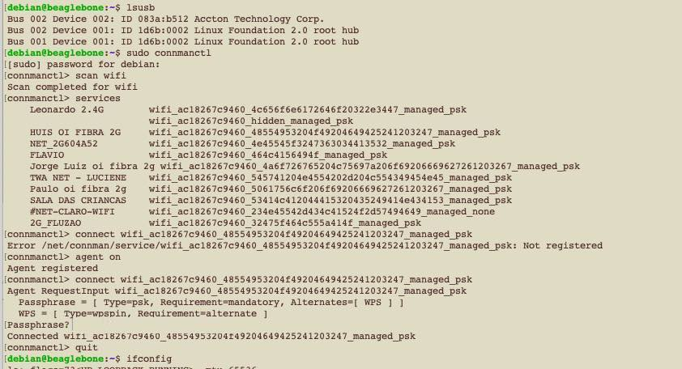
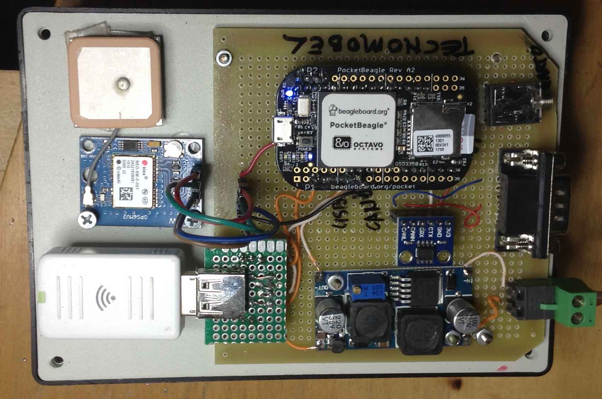

# 1. Computador de bordo 

`Documentos/GitHub/Computador-de-bordo`

Escolheu-se para o computador de bordo do BRElétrico o minicomputador *Beagle Bone*. A sua escolha se baseou no fato de ter uma arquitetura apropriado para sistemas embarcadas baseado em num ARM, ter além do processador principal, dois *Programmable Real-time Unit (PRU)* que podem ser usados para alguma necessidade de processamento dedicado e dois controladores CAN já incorporados na sua placa.

Há diversas versões do Beagle Bone. Um dos mais populares é o *Beagle Bone Black (BBB)* que foi a primeira versão usado neste desenvolvimento.

BBB tem uma interface HDMI, porta ethernet, porta USB e já vem com Linux embarcada e toda estrutura de software para habilita-lo como servidor com toda funcionalidade TCP-IP internet inerente do Linux. 

A figura a seguir mostra o diagrama do bloco do computador de bordo com display HDMI no painel do veículo e as redes  CAN ligado aos módulos. 


Entretanto, há uma versão mais nova que foi lançada recentemente que é mais compacto (e barato). O PocketBeagle, tem toda a funcionalidade do BBB, mas diversos conectores físicos dos interfaces da BBB foram retiradas e também foi retidada a interface HDMI. 

Para implementar a proposta foi necessário ligar um transciever CAN para  adequar os sinais cmos do Beagle ao padrão do barramento CAN. Este módulo é alimentado com 3.3V podendo ser diretamente ligado no barramento de expansão do Beagle.

O Beagle funcionará como ponte entre as duas redes CAN e a rede TCP-IP. A partir da rede TCP-IP pode-se ter acesso ao Beagle permitindo a sua monitoração remoto ou re-programação.

A primeira rede Can (Can0) estará ligado aos subsistemas críticos do veículo elétrica, fazendo o monitoramento do banco do bateria, o motor de tração e outros subsistemas que precisam comunicar entre se neste barramento mas rápido. 

A segunda rede (Can1) permitirá a comunicação entre o modulo de medição de velocidade e temperatura, o módulo de sinalização e luzes e demais módulos que não são críticos ao funcionamento do veículo. A comunicação destes útimo barramento pode ter uma velocidade menor que o primeiro.

A implementação deste sistema foi feito com um PocketBeagle e um modulo conversor CAN baseado no transciever SN65HVD230, conforme mostrado na foto a seguir:


O Pocket Beagle foi montado numa placa com transciever CAN, conversor CC/CC 12/5 volts, Wifi USB Dongle, e acesso para o serial UART.  

A tabela a seguir mostra a proposta de uso dos periféricos do Pocket Beagle. 

| Beagle  | uso             | pinos | Situação |
|:-------:|:---------------:|:-----:|:--------:|
| CAN 0   | Barramento CAN  | P1 - 26, 28 | Implementado |
| CAN 1   | ainda nao ligado fisicamente  | P2 - 9,8    | Ainda não |
| USB     | WiFi Dongle     | P1 - 5,7,9,11,13,15 | Implementado |
| UART0   | Acesso ao Beagle pelo serial com terminal | P1 - 30, 32 | Implementado |
| UART 2  | Serial GPS      | P1 - 8,10 | Ainda não |
| UART 4  | Serial LoRa Radio | P2 5,7 | Ainda não


## 2.1 Configurando o PocketBealge

O primeiro passo é configurar o hardware do PocketBeagle para a proposta.
O PocketBeagle pode ser accessado na USB pelo comando:
 
`ssh debian@192.168.6.2`  ou `ssh debian@beaglebone.local` 

e a senha padrão do Beagle é `temppwd` 

Os pinos no barramento de acesso do PocketBeagle podem ser configurados para dar acesso a várias funcionalidades do computador. 

A dificuldade consiste no fato de o Beagle ter um sistemática de mapeamento de hardware no sistema operacional Linux específica, diferente dos computadores convencionais. O Beagle é um computador numa única placa que usa o processador com arquitetura ARM. Por conta dos inúmeros sistemas baseados no arquitetura ARM que surgiram para sistemas embarcadas, houve uma modificação no Kernel do Linux para dar conta a especificidades destes sistemas.


### 2.1.1 Acessando o Beagle pelo Serial UART

Uma maneira simples de acessar o Beagle sem ter que usar monitor teclado ou rede é pela porta UART0 do Beagle.
Essa porta já vem habilitado para você entrar por meio de um programa emulador de terminal. 
Os pinos do Pocket Beagle que permitem este acesso são dados na tabela a seguir. 

| Beagle  | con | pino | UART | pino |
|:-------:|:---:|:----:|:----:|:----:|
| gnd     | P1  | 16   | GND  |   |
| tx uart0| P1  | 30   | rx   |   |
| rx uart0| P2  | 32   | tx   |   |

O nível de tensão do UART é de 3.3 volts, e pode se acessar com um conversor USB- Serial TTL. 

O programa de emulador de terminal tem que estar configurado com a porta serial em 115kbps, 8N1.

A foto a seguir mostra o conversor SERIAL USB-TTL que foi usado para ligar o Beagle a porta USB de computador para ter acesso via terminal ao Beagle.
 


### 2.2.2 Configurando CAN

No sistema operacional Linux  convencional as especificidades do hardware são de certa forma incorporadas no Kernel, mas este sistemática se mostrou impraticável com as placas ARM. Por isso foi introduzido a estrutura de Device Tree para que o computador Beagle saiba qual hardware e periféricos estão fisicamente instalados na placa. Veja o artigo de Mateus Gagliardi: Introdução ao uso de Device Tree e Device Tree Overlay em Sistemas Linux Embarcado. 2015. <https://www.embarcados.com.br/device-tree-linux-embarcado/>

No caso do Beagle essa estrutura de Device Tree tem que dar conta para definir quais pinos serão usados do hardware, pois Beagle tem portas genéricas para entrada e saída de dados (GPIO), uma porta analógica (ADC), PWM, UART, SPI e I2C pinos, e estes pinos podem ser configurados para diversos usos. No nosso caso específico, as duas controladoras CAN usam alguns dos pinos da SPI e do I2C como entrada e saída dos sinais CAN. 

Este roteiro é uma adaptação da configuração do BBB no artigo no [https://www.beyondlogic.org/adding-can-to-the-beaglebone-black/](https://www.beyondlogic.org/adding-can-to-the-beaglebone-black/) para o PocketBeagle.

Nos releases dos kernels mais novos a configuração do pinos é melhor documentos. Para ver a versão do kernal pode executar o comando: 

`$ uname --a`

```
Linux beaglebone 4.19.94-ti-r42 #1buster SMP PREEMPT Tue Mar 31 19:38:29 UTC 2020 armv7l GNU/Linux
```

Para verificar se de fato a Can bus está mapeado no kernel pode-se executar o comando 
`$ dmesg | grep can`

A resposta tem que ser algo do tipo: 

```
[    1.047544] c_can_platform 481cc000.can: c_can_platform device registered (regs=5e6dc592, irq=39)
[    1.049113] c_can_platform 481d0000.can: c_can_platform device registered (regs=e2b987c8, irq=40)
[    1.186345] can: controller area network core (rev 20170425 abi 9)
```


O próximo passo é configur as duas portas can0 e can1. 
A figura a seguir mostra os conectores P1 e P2 com as diversas opções dos pinos.


A interface CAN0 pode ser ligado nos pino 26 e 28 do conector P1. 
Nota-se que a interface CAN1 pode ser ligado nos pinos 9,10 ou 25,27.
Escolheu-se ligar os pinos 26 e 28 do P1 para can0 e 26 e 27 do P2 para can1

| Beagle  | con | pino | transciever | pino |
|:-------:|:---:|:----:|:------:|:----:|
| gnd     | P2  | 21   | GND    | 2    |
| 3.3v    | P2  | 23   | 3V3    | 1    | 
| can1 rx | P2  | 25   | CRX    | U1-4 |
| can1 tx | P2  | 27   | CTX    | U1-3 |
| can0 tx | P1  | 26   | CTX    | U2-3 |
| can0 rx | P1  | 28   | CRX    | U2-4 | 


Há um programa de configuração de pinos que permite escolher a funcionalidade do pino e ver seu atual uso.
Por exemplo o seguinte comando lista todas as opções disponíveis para o pino P2.5:
 
`config-pin -l P2.25`

```
Available modes for P2_25 are: default gpio gpio_pu gpio_pd gpio_input spi spi_cs uart can i2c
``` 

Para configurar o pino para acessar a interface can:

`config-pin P2.27 can`

Para finalizar o processe de configuração do hardware temos que iniciar a interface CAN com o seguinte comando: 

` sudo /sbin/ip link set can1 up type can bitrate 500000`

Com isso pode se verificar o status da interface can com os comandos normais de rede do linux que deve mostrar a nova interface can e todos os outros interfaces de comunicação do sistema.

`ifconfig`

Para automatizar o processo de ativação do Can bus no boot ainda falta descobrir como configurar os pinos como interface can durante o boot. 
Uma opção é de colocar dentro do `crontab` uma sequencia de scripts que serão executados durante o boot.  

script de configuração do CAN no arquivo `code/can0_can1_start.sh`

```
#!/bin/bash
echo "Iniciando as configuracoeas dos pinos para a rede CAN..."

config-pin P1.26 can
config-pin P1.28 can
sudo /sbin/ip link set can0 up type can bitrate 250000

config-pin P2.25 can
config-pin P2.27 can
sudo /sbin/ip link set can1 up type can bitrate 250000

echo "Pinos de CAN0 e CAN1 configurados!..."
```

Com isso conseguimos resolver a parte mais difícil até o presente momento que foi a configuração do Beagle para ativar os dois controladores CAN, habilitar o hardware de interfaceamento com os transcievers CAN e configurar a porta de comunicação no linux para conversar com os controladores.

Para testar se os canais CAN estão funcionando, pode fazer o teste com o loopback 
`sudo /sbin/ip link set can0 up type can bitrate 250000 loopback on`


### 2.2.3 Ligando CAN no DB9

Vamos padronizar o conector CAN do Beagle com um DB9 macho com os seguintes pinos.


| Transciever | DB9 | 
|:-----------:|:---:|
| CANL        | 5   |
| CANH        | 3   | 

Essa configuração de pinagem é compativel com a placa Arduino CAn Shield da Sparkfun e o cabo DB9-OBDII que a acompanha.

O Cabo tem a seguinte pinagem  OBDII para DB9 Femea.

| Pin Description   | OBDII | DB9 |
|:------------------|:-----:|:---:|
| J1850 BUS+        |  2 | 7 |
| Chassis Ground    |  4 | 2 |
| Signal Ground     |  5 | 1 |
| CAN High J-2284   |  6 | 3 |
| ISO 9141-2 K Line	|  7 | 4 |
| J1850 BUS-        | 10 | 6 |
| CAN Low J-2284    | 14 | 5 |
| ISO 9141-2 L Line	| 15 | 8 |
| Battery Power     | 16 | 9 |

[https://www.sparkfun.com/products/10087](https://www.sparkfun.com/products/10087)

Tem que ter cuidado de não ligar o DB9 para uma porta serial RS232 convencional, pois os pinos de GND e TX e RX com tensão +de 12 e -12v vão diratemente no transciever. 

Há um outro padrão de pinagem CAN para DB9, mas eu ainda não descobri de onde que vem esta definição. 
Por enquanto vamos manter a padronização, para manter a compatibilidade com cabo DB9-OBDII. 


## 2.2. Testando com can-utils

O sistema operacional Linux embarcada no BBB já vem com pacote SocketCan ou can-utils de ferramentas para trabalhar com a rede de comunicação CAN.
 
Este pacote de ferramentas e utilitários permite visualizar, registrar e gerar tráfego de dados do barramento CAN, além de permitir acesso ao barramento CAN via IP sockets entre vários outros funcionalidades. <https://github.com/linux-can/can-utils>

O utiltário candump do SocketCan permite visualizar os dados do barramento de comunicação.

Com o programa cangen é possivel gerar uma saída aleatorio numa porta can. 
Para testar a rede can executa num terminal :

```
debian@beaglebone:~$ cangen can0
```

Num outro terminal executa 

```
debian@beaglebone:~$ candump any -x 
  can0  RX - -  6B9   [8]  EB 3F 68 35 C9 1B DE 56
  can1  TX - -  6B9   [8]  EB 3F 68 35 C9 1B DE 56
  can0  RX - -  37A   [8]  76 4A DF 7A 42 74 85 5C
  can1  TX - -  37A   [8]  76 4A DF 7A 42 74 85 5C
  can0  RX - -  0EA   [1]  DF
  can1  TX - -  0EA   [1]  DF
  can0  RX - -  69D   [8]  0F E2 C0 10 A8 34 8E 2B
  can1  TX - -  69D   [8]  0F E2 C0 10 A8 34 8E 2B
  can0  RX - -  5EF   [1]  1D
  can1  TX - -  5EF   [1]  1D
```


Há uma vasta documentação técnica sobre o uso do SocketCan em sistemas operacionais Linux acessando a porta CAN a partir de programas desenvolvido em C/C++ ou Python.


## 2.3. Ligando wifi no Beagle

Para facilitar o desenvolvimento no Pocket Beagle é necessário colocar o Beagle diretamente na internet sem usar a porta USB do computador hospedeiro. 

Para configurar o Wifi Dongle foi usado o `connmanctl` conforme mostrado na figura a seguir.


| Beagle  | con | pino | USB | pino |
|:-------:|:---:|:----:|:---:|:----:|
| Vbus    | P1  | 5    | Vcc | 1    |
| Vin     | P1  | 7    | Vcc | 1    | 
| DN      | P1  | 9    |     | 2    |
| DP      | P1  | 11   |     | 3    |
| ID      | P1  | 13   | GND | 4    |
| GND     | P1  | 15   | GND | 4    |




## 2.4. Módulo GPS Ublox 7

* Alimentação: de 3,3 V à 5 V DC
* Corrente de operação: entre 35 mA e 50 mA
* Comunicação serial/TTL 3.3V
* Antena embutida


| Pino | 	Função no GPS | Ligação Beagle |
|:----:|:--------------:|:--------------:|
| 1	 | Vcc            | Vcc |
| 2	 | GND   | GND |
| 3	| TX out | RX2 pino Px-yy |
| 4	| RX in  | TX2 pino Px-yy |

Detalhamento da comunicação. O formato do Protocolo de comunicação NMEA0183.

* Cada início de mensagem começa com o símbolo cifrão(\$).
* Os próximos 5 caracteres indicam a origem da mensagem, sendo dois para a origem e três para o tipo de mensagem.
* Todos os campos dos dados são delimitados por vírgulas.
* O primeiro caractere do último campo deve ser um asterisco (*).
* O asterisco é seguido de um checksum de dois dígitos em hexadecimal
* A mensagem é terminada com um Nova Linha ( <CR><LF> ou "\n" ).




## 2.5. Módulo Radio 

Para implementar o radio enlace entre a estação rádio base e a boia de sinalização foi adquirido o Módulo RF Wireless LoRa 433MHz.

* Módulo Wifi LoRa E32-TTL-100
* Controlador SX1278
* Tecnologia de comunicação LoRa®
* Tensão de alimentação: 2.3 à 5.5VDC
* Nível de comunicação: 5.2V (máximo)
* Distância de transmissão: 3000m (máximo)
* Potência máxima: 2dB (100mW)
* Sensibilidade do receptor:-130dBm @ 1.2Kbps
* Taxa de transferência: 2.4Kbps
* Conector para antena SMA
* Corrente de emissão: 130mA @ 100mW
* Corrente de recepção: 13.5mA @ Mode 0, Mode 1
* Corrente em 10. Sleep Current:2.0uA (M1=1,M1=0)
* Interface de comunicação: UART
* Suporte a RSSI
* Frequencia de operação: 410MHz a 441MHz (Padrão 433MHz)
* Temperatura de operação: -30 ~ 85°C
* Dimensões: 50 x 21 x 10 mm

	O módulo promete um alcance da tecnologia LoRa em torno de 3 à 4Km em área urbana, e aproximadamente 12Km em áreas rurais, distância que pode variar dependendo de obstáculos, paredes, topologia do terreno, etc.
	Está sendo montado uma instalação no campus Gama para testar essa tecnologia e confirmar o seu alcance. A figura a seguir mostra a descrição dos pinos do módulo.
	
	


# 3. Comunicação no barramento CA - Camadas superiores

O computador de bordo tem que monitorar o controlador do motor elétrico e o BMS no barramento CAN de alta prioridade (velocidade).

O computador de bordo (OBC) tem que ser flexivel o bastante para se comunicar com diversos modelos de controladores de motores elétricos e BMS.  

No caso do BRElétrico, temos um motor de CC brushless do fabricante Guandong que tem uma interface CAN. A documentação deste controlador e motor não é dos melhores, mas pelo menos temos a especificação do protocolo CAN usado pelo controlador e indica que usa o protocolo J1939 nas camadas superiorers.

No projeto da conversão da VAN vamos usar o CVW500 da WEG que também tem uma interface CAN e implementa o protocolo CANOPEN.

Vamos implementar os dois protocolos e testar. O J1939 vai ser implementado para o BREletrico e o CANOPEN para a VAN. 
O J1939 tem a vantagem de ser específico para aplicações de mobilidade. 


## 3.1. Protocolo J1939

O protocolo J1939 em termos gerais define as mensagens que vão transitar no barramento, para onde eles vão, as prioridades das mensagens e frequencia com que determinadas mensagens são disponibilizados no barramento.

Dessa foram, o computador de bordo só precisa monitorar o barramento e usar as mensagens que lhe interessa para tomar determinada ação e colocar mensagens com as suas demandas ou ações no barramento de volta. 

Por exemplo: O protocolo J1939 implementado pelo controlador do motor elétrico manda a cada 40ms informação com a tensão e corrente do motor. O BMS manda também em tempos regulares o estado da bateria, indicando quanto de energia ainda tem disponível. O módulo de instrumentação manda a cada 100ms a informação da velocidade do veículo. Com estes dados, o OBC computador de bordo pode calcular por exemplo qual automia em Km, mantendo o mesmo padrão de direção e mostrar essa informação para o condutor.


### Estrutura do J1939

O J1939 aproveita o identificador do 29 bits do CAN para passar informações específicas do tipo de comunicação. 

A estrutura de bits da identificação tem o seguinte formato.

| priority | Extendes data page | data page | PDU Format | PDU Specific | source adddres |
|:------:|:-----:|:----:|--------|--------|--------|
| 3 bits | 1 bit | 1bit | 8 bits | 8 bits | 8 bits |


Os campos PDU Format e PDU Specific construem o valor que será atribuído ao Parameter Group Number PGN da mensagem e também definem o modo como as mensagens são endereçadas no barramento.

| PDU Format | descriçao | PDU Specific | 
|:-----:|:----:|:------:|
| 0-0xEF ou 0-239 | transmite para endereco indicado no PDU specific | endereco|
| 0xF0-0xFF ou 240-255 | broadcast | Indice de referencia do Group Extension |  

A formatação do PGN é (PDU format) * 0x100 + PDU specific  


## 3.1. Controlador Motor PM BLDC Guandong

Os parametros do Controlador do motor Brushless CC PM BLDC Guandong são mandados por um CAN frame com as seguintes especificações. O fabricante menciona que os protocolos usados são CAN20.0 e J1939

Bus rate: 250kbps

A taxa de envio é 40 ms mandando 2 mensagens, ou seja uma mensagem a cada 20 ms.
 
O protocolo usa CAN 2.0 com CAN expand frame 29th identifier

A primeira mensagem (*frame*) frame ID code é `0x10 08 8A 9E.` ou `268.995.230`.
Isso é uma mensagem que vai de `8A` para `9E`, pois o campo PDU format `08` é menor que `EF`. Ou seja, o endereço do controlador é `9E`. 

O dados encaminhados na mensagem são os seguintes:


| Location | data name           |  explain   |
|:--------:|:-------------------:|:---------:|
| BYTE1    | voltage low byte    | 0.1 V/bit offset: -10000 range: 0~500v (o offset tá meio estranho )|
| BYTE2    | voltage high byte   |
| BYTE3    | currente low byte   | 0.1 A/bit offset: -10000 range -500A~500A |
| BYTE4    | currente high byte  |
| BYTE5    | controller temperature | 1℃/bit offset: 40C limit: 0~100℃ |
| BYTE6    | running state |
| BYTE7    | fault code low byte  |
| BYTE8    | fault code high byte |

O BYTE 6 com o Running status tem o seguinte formato: 


| BIT7 | BIT6 | BIT5 | BIT4 | BIT3 | BIT2 | BIT1 | BIT0 | 
|:----:|:----:|:----:|:----:|:----:|:----:|:----:|:----:|
| reserved | ready for | reserved | reserved | stop | brake | backward | forward|


O código de erro nos BYTES 7 e 8 (*Fault code instruction*) tem os seguintes formatos 

| BIT7 | BIT6 | BIT5 | BIT4 | BIT3 | BIT2 | BIT1 | BIT0 | 
|:----:|:----:|:----:|:----:|:----:|:----:|:----:|:----:|
| 0 | ERR7| ERR6 | ERR5 | ERR4 | ERR3 | ERR2 | ERR1 |
| 75℃ | BMS | over speed | over heating | over voltage | under voltage | over current | IGBT |


A segunda mensagem (*frame ID code*) tem como código de identificação de `0x10 09 8A 9E`  ou `269.060.766`. 
Os dados mostram a operação do motor da seguinte maneira:

| DATA LOCATION | DATA NAME | explain |
|---------------|-----------|---------|
| BYTE1 | motor speed low byte | 1rpm,  offset： 0, range：0 ～10000 |
| BYTE2 | motor speed high byte | |
| BYTE3 | mileage low byte	| 0.1	kilometer, offset：0, range：0～30000| 
|BYTE4	| mileage high byte |	
|BYTE5	| motor torque low byte	 | 0.1NM, offset：-10000, range：-1000～1000 (o valor do offset é estranho .....) |
|BYTE6	| motor torque high byte |
|BYTE7	| reserved|	
|BYTE8	| reserved|
	
```
0x10088A9E = PDU format 0x08, specific 0x8A, PGN = 2186, source adress = 0x9E
0x10098A9E = PDU format 0x09, specific 0x8A, PGN = 2442, source adress = 0x9E
```

Para facilitar o desenvolvimento do OBC fizemos uma programa de simulação da comunicação do controlador PM BLDC Guandong em python com a biblioteca Python CAN [https://python-can.readthedocs.io/en/master/](https://python-can.readthedocs.io/en/master/)

O programa está no diretório:

`code_simulador_motor/simulador_motor.py`

O simulador gera as seguintes mensagens no barramento a cada 20ms, conforme especificado no datasheet do fabricante.


```
debian@beaglebone:~/src$ candump can1
  can1  10088A9E   [8]  C4 09 E8 03 28 41 00 40
  can1  10098A9E   [8]  E8 03 D0 07 78 00 FF FF
  can1  10088A9E   [8]  C4 09 E8 03 28 41 00 40
  can1  10098A9E   [8]  E8 03 D0 07 78 00 FF FF 
```
para os parametros
 
```
run.stop=0
run.forward=1
run.readyfor=1
fault.bms=1
voltage= 250 V
current= 100 A
temperature= 40 oC
rpm = 1000 rpm
mileage = 2000 km
torque =  120 Nm
```

O programa de simulação do motor PM da Guandong foi feito de forma codificando diretamente os valores num frame CAN.
Este método funciona quando é um sistema com muito poucos nós e poucas mensagens.
Na medida que os sistemas incorporam mais ECUs no barramento vai ser necessário usar ferramentas específicas para analisar e acompanhar o trafego na rede. 

O protocolo J1939 especifica as camadas as camada de rede e as camadas superiores do modelo OSI. 
A camada de rede tem a necessidade de, em primeiro lugar, definir o sistema de endereçamento da rede e garantir a entrega dos pacotes ou mensagens para os endereçados.

Assim os ECUs numa rede CAN devem ter pelo menos um endereço para poder encaminhar as mensagens. 
O protocolo J1939 define que os ECUs devem ter pelo menos um endereço físico e um nome. 
Entretanto, um ECUs pode controlar mais endereços e nomes. 
A função do endereço é definir o destino ou a origem da mensagem, enquanto o nome inclua uma indicação da funcionalidade do ECU no endereço.

A identificação do frame no caso do Controlador do Motor Guandong é `0x10 08 8A 9E` e `0x10 09 8A 9E`. 
Essas identificações são formados por 29 bits ou 4 bytes (32 bits - 3 bits). 

O últime byte é o endereço de origem, que neste caso é 0x9E.
Em seguida vem dois bytes que formam o Parameter Grupo Number (PGN). 
As duas mensagens mandados pelo motor tem como Paramater Group Number PGN 0x088A e 0x098A respectivamente.

Com os bytes mais significativo do PGN (0x88 e 0x98) ficam dentra da faixa de [0x00-0xEF] o byte menos significativo do PGN indica o endereço de destino da mensagem. 
Neste caso o endereço de destino é 0x8A. 
Se o byte mais significiva do fosse entre a faixa de [0xF0 a 0xFF] a mensagem seria do tipo broadcast. 

Precisa-se ainda confirmar essa informação, pois eu não sei se o PGN é formado com a configuração big endian ou little endian, podendo ser 0x088A ou 0x8A08.
 
O PGN do J1939 especificam um dicionário de dados, para que se possa traduzir os bytes da mensagem em valores físicos do veículo por meio de DBC ou Database Can, também chamado de dicionário de dados.


## 3.2. Modulo de instrumentação

O módulo de instrumentação monitora a velocidade do veículo assim como controla o sistema de arrefeciento do veículo e o sistema do servo freio, assim com monitora outros subsistemas do veículo. 

O modulo de instrumentação está documentado em 
[`https://github.com/Tecnomobele-FGA/Modulo-instrumentacao`](https://github.com/Tecnomobele-FGA/Modulo-instrumentacao)

O link para a implementação do programa de controle está em 
[`https://github.com/rudivels/BREletrica_Sensor_CAN_Lcd_Velocidade_temperatura`](https://github.com/rudivels/BREletrica_Sensor_CAN_Lcd_Velocidade_temperatura)  


## 3.3. Módulo de Luzes

O módulo de luzes controle todos comandos de sinalização do painel e comanda as luzes a sinalização. 

O módulo está documentado em
 
[`https://github.com/Tecnomobele-FGA/Modulo-luzes`](https://github.com/Tecnomobele-FGA/Modulo-luzes)

O link pata a implementação do programa de controle está em 

[`https://github.com/rudivels/BREletrica_Luzes_CAN_beep_display`](https://github.com/rudivels/BREletrica_Luzes_CAN_beep_display)

## 3.4. BMS Battery Management System


O BMS é modelo EK-YT-21-BMS. 

A documentação se encontra no link 
[https://github.com/Tecnomobele-FGA/Banco-baterias](https://github.com/Tecnomobele-FGA/Banco-baterias)

O BMS é composto por 4 modulos de 16 celular LIFEPO4, ligado por meio de uma barramento próprio, passando alimentação e sinais para o modulo concentrador. Este modulo concentrador tem duas portas CAN. Uma porta para  o Battery Charger e outro avulso. 

Com o osciloscópio mediu-se o sinal no barramento CAN e descobriu-se que a velocidade de comunicação do barramento era de 250khz. 

Foi feito o teste em 14/05/2020 com Arduino e Can sheild da sparkfun. 
Ligou somente um modulo de batterias (tensão +-40 volts) e o display do BMS. 
Sem ligar o sparkfun o barramento mostra uma atividade muito intensa no osciloscópio. Assim que coloca o sparkfun, no barramento aparece somente um pacote de dados a cada 2 segundos.

Com o programa 
`CAN Read Demo for the SparkFun CAN Bus Shield.`
da biblioteca de CAN do Arduino Shield consegui ler o barramento. Configurou o programa para 250khz e a porta serial 57200 bps. 

Quando liga o concentrador somente com um modulo e o display e o Arduino CAN Shield.  

Testando com candump dia 04 junho 2020 ligando o BMS

```
breletrico@AcerNetbook:~$ candump can0 -c -tA -a
 (2020-06-04 13:35:16.779575)  can0  1806E5F4   [8]  09 99 00 0F 00 00 00 00   '........'
 (2020-06-04 13:35:16.782567)  can0  0CF1EFF4   [8]  00 00 00 00 00 00 00 00   '........'
 (2020-06-04 13:35:17.782563)  can0  1806E5F4   [8]  09 99 00 0F 00 00 00 00   '........'
 (2020-06-04 13:35:17.782604)  can0  0CF1EFF4   [8]  00 00 00 00 00 00 00 00   '........'
 (2020-06-04 13:35:18.782639)  can0  1806E5F4   [8]  09 99 00 0F 00 00 00 00   '........'
 (2020-06-04 13:35:18.782687)  can0  0CF1EFF4   [8]  00 00 00 00 00 00 00 00   '........'
 (2020-06-04 13:35:19.781635)  can0  1806E5F4   [8]  09 99 00 0F 00 00 00 00   '........'
 (2020-06-04 13:35:19.781682)  can0  0CF1EFF4   [8]  00 00 00 00 00 00 00 00   '........'
 (2020-06-04 13:35:20.780662)  can0  1806E5F4   [8]  09 99 00 0F 00 00 00 00   '........'
 (2020-06-04 13:35:20.784656)  can0  0CF1EFF4   [8]  00 00 00 00 00 00 00 00   '........'
 (2020-06-04 13:35:21.784668)  can0  1806E5F4   [8]  09 99 00 0F 00 00 00 00   '........'
 (2020-06-04 13:35:21.784720)  can0  0CF1EFF4   [8]  00 00 00 00 00 00 00 00   '........'
 (2020-06-04 13:35:22.783705)  can0  1806E5F4   [8]  09 99 00 0F 01 00 00 00   '........'
 (2020-06-04 13:35:22.783752)  can0  0CF1EFF4   [8]  00 00 00 00 00 00 00 00   '........'
 (2020-06-04 13:35:23.783718)  can0  1806E5F4   [8]  09 99 00 0F 01 00 00 00   '........'
 (2020-06-04 13:35:23.786722)  can0  0CF1EFF4   [8]  00 00 00 00 00 00 00 00   '........'
 (2020-06-04 13:35:24.786772)  can0  1806E5F4   [8]  09 99 00 0F 01 00 00 00   '........'
 (2020-06-04 13:35:24.786814)  can0  0CF1EFF4   [8]  00 00 00 00 00 00 00 00   '........'
```

Teste com timestamp e Chaveado a bateria on/off

`0x1806E5F4 = PDU Format 0x06, PDU Specific 0xE5, PGN = 1765, source adress = 0xF4`
`0x0CF1EFF4 = PDU Format 0xF1, PDU Specific 0xEF, PGN = 61935, source address = 0xF4`

Dá para concluir que o endereço de origem (Source Address) é 0xF4.
A primeira mensagem é destinada ao endereço 0xE5 enquanto a segunda mensagem é do tipo broadcast.

A descrição do protocolo J1939 do BMS está no [https://github.com/Tecnomobele-FGA/Banco-baterias](https://github.com/Tecnomobele-FGA/Banco-baterias)


# 4. Database CAN - DBC ou dicionário de dados

A partir da documentação dos dados de todos os equipamentos que estão ligados no barramento CAN podemos construimos um dicionário de dados DBC.

A montagem do DBC foi baseado no documento da CSS-Electronics [`https://www.csselectronics.com/screen/page/can-dbc-file-database-intro`](https://www.csselectronics.com/screen/page/can-dbc-file-database-intro)

Até o presente momento temos 5 ECU que vão ser interligados no barramento CAN.
Foi feito um ajuste para setar o primeiro bit do ID em 1.

Tabela com os ECU e seus ID.


| nome | ECU       | Id mensagem | Id  (hex) |
|:-----|:---------:|------------:|----------:|
| EVEC1 | Controlador motor elétrico Guandong | 2416544414 | 0x90098A9E |
| EVEC2 | Controlador motor elétrico Guandong | 2416478878 | 0x90088A9E |
| MODINSTRUM | Módulo de Instrumentação | 2432614288 | 0x90FEBF90 |
| BMS   | BMS  (EK-YT-21-BMS)  | 2550588916| 0x9806E5F4 |
| CCS   | Zepia TCCH-H233-10-C | 2566869221| 0x98FF50E5 |
| MODLUZ | Módulo de luzes e sinalização| |


O arquivo é  `BRELETmotorV3.dbc` na pasta `DBC`


```
VERSION ""

NS_ : 
    NS_DESC_
    CM_
    BA_DEF_
    BA_
    VAL_
    CAT_DEF_
    CAT_
    FILTER
    BA_DEF_DEF_
    EV_DATA_
    ENVVAR_DATA_
    SGTYPE_
    SGTYPE_VAL_
    BA_DEF_SGTYPE_
    BA_SGTYPE_
    SIG_TYPE_REF_
    VAL_TABLE_
    SIG_GROUP_
    SIG_VALTYPE_
    SIGTYPE_VALTYPE_
    BO_TX_BU_
    BA_DEF_REL_
    BA_REL_
    BA_DEF_DEF_REL_
    BU_SG_REL_
    BU_EV_REL_
    BU_BO_REL_
    SG_MUL_VAL_

BS_:

BU_:

BO_ 2432614288 MODINSTRUM: 8 Vector__XXX
 SG_ Velocity : 0|16@1+ (1,0) [0|200] "km/h" Vector__XXX

BO_ 2416544414 EVEC1: 8 Vector__XXX
 SG_ EngineSpeed : 0|16@1+ (1,0) [0|10000] "rpm" Vector__XXX
 SG_ Mileage     : 16|16@1+ (0.1,0) [0|300000] "km" Vector__XXX
 SG_ MotorTorque : 32|16@1+ (0.1,-1000) [-1000|1000] "Nm" Vector__XXX

BO_ 2416478878 EVEC2: 8 Vector__XXX
 SG_ Voltage : 0|16@1+ (0.1,-1000) [0|500] "v" Vector__XXX
 SG_ Current :16|16@1+ (0.1,-1000) [-500|500] "A" Vector__XXX
 SG_ Temperature :32|8@1+ (0.1,40) [0|100] "A" Vector__XXX
 SG_ Forward  :40|1@0+ (1,0) [0|0] "-" Vector__XXX
 SG_ Backward :41|1@0+ (1,0) [0|0] "-" Vector__XXX 
 SG_ Brake    :42|1@0+ (1,0) [0|0] "-" Vector__XXX 
 SG_ Stop     :43|1@0+ (1,0) [0|0] "-" Vector__XXX 
 SG_ Ready    :46|1@0+ (1,0) [0|0] "-" Vector__XXX  
 SG_ IGBT         :48|1@0+ (1,0) [0|0] "-" Vector__XXX 
 SG_ OverCurrent  :49|1@0+ (1,0) [0|0] "-" Vector__XXX 
 SG_ UnderVoltage :50|1@0+ (1,0) [0|0] "-" Vector__XXX  
 SG_ OverVoltage  :51|1@0+ (1,0) [0|0] "-" Vector__XXX  
 SG_ OverHeating  :52|1@0+ (1,0) [0|0] "-" Vector__XXX    
 SG_ OverSpeed    :53|1@0+ (1,0) [0|0] "-" Vector__XXX   
 SG_ BMS          :54|1@0+ (1,0) [0|0] "-" Vector__XXX 
 SG_ Error75g     :55|1@0+ (1,0) [0|0] "-" Vector__XXX     


BO_ 2550588916 BMS: 8 Vector__XXX
 SG_ MaxChargingVoltage :  0|16@1+ (0.1,0) [0|1000] "V" Vector__XXX
 SG_ MaxChargingCurrent : 16|16@1+ (0.1,0) [0|1000] "A" Vector__XXX
 SG_ ControlCharging  : 32|1@0 + (1,0) [0|0] "-" Vector__XXX
 
BO_ 2566869221 CCS: 8 Vector__XXX
 SG_ OutputVoltage :    0|16@1+ (0.1,0) [0|10000] "V" Vector__XXX
 SG_ OutputCurrent :   16|16@1+ (0.1,0) [0|10000] "A" Vector__XXX
 SG_ HardwareFailure      : 32|1@0 + (1,0)   [0|0] "-" Vector__XXX
 SG_ TemperatureOfCharger : 33|1@0 + (1,0)   [0|0] "-" Vector__XXX
 SG_ InputVoltage         : 34|1@0 + (1,0)   [0|0] "-" Vector__XXX
 SG_ StartingState        : 35|1@0 + (1,0)   [0|0] "-" Vector__XXX
 SG_ ComunicationState    : 36|1@0 + (1,0)   [0|0] "-" Vector__XXX

CM_ BO_ 2432614288 "Modulo de instrumentacao";
CM_ SG_ 2432614288 Velocity "Velocidade da roda dianteira ";
CM_ BO_ 2416544414 "Electric Vehicle Electronic Engine Controller 1";
CM_ SG_ 2416544414 EngineSpeed "Atual rotacao do motor electrico.";
CM_ SG_ 2416544414 Mileage "Atual quilometragem. ";
CM_ SG_ 2416544414 MotorTorque "Atual torque do motor. ";
CM_ BO_ 2416478878 "Electric Vehicle Electronic Engine Controller 2";
CM_ SG_ 2416478878 Voltage "Voltage of motor controller. ";
CM_ SG_ 2416478878 Current "Current of motor controller. ";
CM_ SG_ 2416478878 Temperature "Temperature of motor controller. ";
CM_ SG_ 2416478878 Forward "Estado do motor para frente. ";
CM_ SG_ 2416478878 Backward "Estado do motor para traz. ";
CM_ SG_ 2416478878 Brake "Estado do motor Freio. ";
CM_ SG_ 2416478878 Stop "Estado do motor Parada. ";
CM_ SG_ 2416478878 Ready "Estado do motor Pronto. ";
CM_ SG_ 2416478878 IGBT "Erro no IGBT. ";
CM_ SG_ 2416478878 OverCurrent "Erro de Sobre Corrente Overcurrent. ";
CM_ SG_ 2416478878 UnderVoltage "Erro de Sob tensao Undervoltage. ";
CM_ SG_ 2416478878 OverVoltage "Erro de Sobre tensao OverVoltage. ";
CM_ SG_ 2416478878 OverHeating "Erro de Sobre Temperatura OverHeating. ";
CM_ SG_ 2416478878 OverSpeed "Erro de Sobre Velocidade OverSpeed. ";
CM_ SG_ 2416478878 BMS "Erro de BMS. ";
CM_ SG_ 2416478878 Error75g "Erro de 75 graus Celsius. ";
CM_ BO_ 2550588916 "Battery Management System";
CM_ SG_ 2550588916 MaxChargingVoltage "Tensao maxima admisivel "; 
CM_ SG_ 2550588916 MaxChargingCurrent "Corrente maxima admisivel "; 
CM_ SG_ 2550588916 ControlCharging "controle charging 0=start 1=stop ";  
CM_ BO_ 2566869221 "Charger Controle System";
CM_ SG_ 2566869221 OutputVoltage "Tensao de saida. "; 
CM_ SG_ 2566869221 OutputCurrent "Corrente de saida. "; 
CM_ SG_ 2566869221 HardwareFailure  "0=normal 1=failure "; 
CM_ SG_ 2566869221 TemperatureOfCharger  "0=normal 1=Over temperature protection"; 
CM_ SG_ 2566869221 InputVoltage  "0=normal "; 
CM_ SG_ 2566869221 StartingState  "0=charger detects battery voltage and starts, 1=charges stays turned of (to prevent reverse polarity) "; 
CM_ SG_ 2566869221 ComunicationState  "0=communication is normal, 1=communication recieve time-out "; 

BA_DEF_ SG_  "SPN" INT 0 524287;
BA_DEF_ BO_  "VFrameFormat" ENUM  "StandardCAN","ExtendedCAN","reserved","J1939PG";
BA_DEF_  "DatabaseVersion" STRING ;
BA_DEF_  "BusType" STRING ;
BA_DEF_  "ProtocolType" STRING ;
BA_DEF_  "DatabaseCompiler" STRING ;
BA_DEF_DEF_  "SPN" 0;
BA_DEF_DEF_  "VFrameFormat" "J1939PG";
BA_DEF_DEF_  "DatabaseVersion" "";
BA_DEF_DEF_  "BusType" "";
BA_DEF_DEF_  "ProtocolType" "";
BA_DEF_DEF_  "DatabaseCompiler" "";
BA_ "ProtocolType" "J1939";
BA_ "BusType" "CAN";
BA_ "DatabaseCompiler" "Projeto BREletrico UnB";
BA_ "DatabaseVersion" "1.0.0";
BA_ "VFrameFormat" BO_ 2416544414 3;
BA_ "SPN" SG_ 2416544414 EngineSpeed 190;
BA_ "SPN" SG_ 2416478878 Voltage 84;
```

Tive que fazer uma adaptação no frame ID code de `0x10088A9E` ou `268995230`. 
Para que o CANTOOLS decodifica corretamente o código de 11 bits tivemos que mudar o frame para `0x90088A9E` ou seja, colocar um bit no primeiro bit da frame. Eu ainda não sei por que, mas deve ter a ver com o formato da frame.


Para conferir o DBC pode se usar o comando 
`$ cantools dump BRELETmotorV3.dbc` que gera automaticamente a estrutura do DBC.

## 4.1. Dicionário de dados do Modulo de instrumentação

Falta a informação do cycle time no DBC. 

```   ------------------------------------------------------------------------

  Name:       MODINSTRUM
  Id:         0x10febf90
      Priority:       4
      PGN:            0x0febf
      Source:         0x90
      Destination:    All
      Format:         PDU 2
  Length:     8 bytes
  Cycle time: - ms
  Senders:    -
  Layout:

                          Bit

             7   6   5   4   3   2   1   0
           +---+---+---+---+---+---+---+---+
         0 |------------------------------x|
           +---+---+---+---+---+---+---+---+
         1 |<------------------------------|
           +---+---+---+---+---+---+---+---+
             +-- Velocity
           +---+---+---+---+---+---+---+---+
     B   2 |   |   |   |   |   |   |   |   |
     y     +---+---+---+---+---+---+---+---+
     t   3 |   |   |   |   |   |   |   |   |
     e     +---+---+---+---+---+---+---+---+
         4 |   |   |   |   |   |   |   |   |
           +---+---+---+---+---+---+---+---+
         5 |   |   |   |   |   |   |   |   |
           +---+---+---+---+---+---+---+---+
         6 |   |   |   |   |   |   |   |   |
           +---+---+---+---+---+---+---+---+
         7 |   |   |   |   |   |   |   |   |
           +---+---+---+---+---+---+---+---+

  Signal tree:

    -- {root}
       +-- Velocity

  ------------------------------------------------------------------------
```

## 4.2. Dicionário de dados do Controlador do Motor
 
``` ------------------------------------------------------------------------

  Name:       EVEC1
  Id:         0x10098a9e
      Priority:       4
      PGN:            0x00900
      Source:         0x9e
      Destination:    0x8a
      Format:         PDU 1
  Length:     8 bytes
  Cycle time: - ms
  Senders:    -
  Layout:

                          Bit

             7   6   5   4   3   2   1   0
           +---+---+---+---+---+---+---+---+
         0 |------------------------------x|
           +---+---+---+---+---+---+---+---+
         1 |<------------------------------|
           +---+---+---+---+---+---+---+---+
             +-- EngineSpeed
           +---+---+---+---+---+---+---+---+
         2 |------------------------------x|
           +---+---+---+---+---+---+---+---+
     B   3 |<------------------------------|
     y     +---+---+---+---+---+---+---+---+
     t       +-- Mileage
     e     +---+---+---+---+---+---+---+---+
         4 |------------------------------x|
           +---+---+---+---+---+---+---+---+
         5 |<------------------------------|
           +---+---+---+---+---+---+---+---+
             +-- MotorTorque
           +---+---+---+---+---+---+---+---+
         6 |   |   |   |   |   |   |   |   |
           +---+---+---+---+---+---+---+---+
         7 |   |   |   |   |   |   |   |   |
           +---+---+---+---+---+---+---+---+

  Signal tree:

    -- {root}
       +-- EngineSpeed
       +-- Mileage
       +-- MotorTorque

  ------------------------------------------------------------------------

  Name:       EVEC2
  Id:         0x10088a9e
      Priority:       4
      PGN:            0x00800
      Source:         0x9e
      Destination:    0x8a
      Format:         PDU 1
  Length:     8 bytes
  Cycle time: - ms
  Senders:    -
  Layout:

                          Bit

             7   6   5   4   3   2   1   0
           +---+---+---+---+---+---+---+---+
         0 |------------------------------x|
           +---+---+---+---+---+---+---+---+
         1 |<------------------------------|
           +---+---+---+---+---+---+---+---+
             +-- Voltage
           +---+---+---+---+---+---+---+---+
         2 |------------------------------x|
           +---+---+---+---+---+---+---+---+
         3 |<------------------------------|
           +---+---+---+---+---+---+---+---+
             +-- Current
           +---+---+---+---+---+---+---+---+
         4 |<-----------------------------x|
           +---+---+---+---+---+---+---+---+
             +-- Temperature
           +---+---+---+---+---+---+---+---+
     B   5 |   |<-x|   |   |<-x|<-x|<-x|<-x|
     y     +---+---+---+---+---+---+---+---+
     t           |           |   |   |   +-- Forward
     e           |           |   |   +-- Backward
                 |           |   +-- Brake
                 |           +-- Stop
                 +-- Ready
           +---+---+---+---+---+---+---+---+
         6 |<-x|<-x|<-x|<-x|<-x|<-x|<-x|<-x|
           +---+---+---+---+---+---+---+---+
             |   |   |   |   |   |   |   +-- IGBT
             |   |   |   |   |   |   +-- OverCurrent
             |   |   |   |   |   +-- UnderVoltage
             |   |   |   |   +-- OverVoltage
             |   |   |   +-- OverHeating
             |   |   +-- OverSpeed
             |   +-- BMS
             +-- Error75g
           +---+---+---+---+---+---+---+---+
         7 |   |   |   |   |   |   |   |   |
           +---+---+---+---+---+---+---+---+

  Signal tree:

    -- {root}
       +-- Voltage
       +-- Current
       +-- Temperature
       +-- Ready
       +-- Stop
       +-- Brake
       +-- Backward
       +-- Forward
       +-- Error75g
       +-- BMS
       +-- OverSpeed
       +-- OverHeating
       +-- OverVoltage
       +-- UnderVoltage
       +-- OverCurrent
       +-- IGBT

  ------------------------------------------------------------------------

```


## 4.3. Dicionário de dados do BMS

```
  ------------------------------------------------------------------------

  Name:       BMS
  Id:         0x1806e5f4
      Priority:       6
      PGN:            0x00600
      Source:         0xf4
      Destination:    0xe5
      Format:         PDU 1
  Length:     8 bytes
  Cycle time: - ms
  Senders:    -
  Layout:

                          Bit

             7   6   5   4   3   2   1   0
           +---+---+---+---+---+---+---+---+
         0 |------------------------------x|
           +---+---+---+---+---+---+---+---+
         1 |<------------------------------|
           +---+---+---+---+---+---+---+---+
             +-- MaxChargingVoltage
           +---+---+---+---+---+---+---+---+
         2 |------------------------------x|
           +---+---+---+---+---+---+---+---+
     B   3 |<------------------------------|
     y     +---+---+---+---+---+---+---+---+
     t       +-- MaxChargingCurrent
     e     +---+---+---+---+---+---+---+---+
         4 |   |   |   |   |   |   |   |<-x|
           +---+---+---+---+---+---+---+---+
                                         +-- ControlCharging
           +---+---+---+---+---+---+---+---+
         5 |   |   |   |   |   |   |   |   |
           +---+---+---+---+---+---+---+---+
         6 |   |   |   |   |   |   |   |   |
           +---+---+---+---+---+---+---+---+
         7 |   |   |   |   |   |   |   |   |
           +---+---+---+---+---+---+---+---+

  Signal tree:

    -- {root}
       +-- MaxChargingVoltage
       +-- MaxChargingCurrent
       +-- ControlCharging

  ------------------------------------------------------------------------
```
## 4.4. Dicionário de dados Controlador de carga CCS

```
------------------------------------------------------------------------
  
  

  Name:       CCS
  Id:         0x18ff50e5
      Priority:       6
      PGN:            0x0ff50
      Source:         0xe5
      Destination:    All
      Format:         PDU 2
  Length:     8 bytes
  Cycle time: - ms
  Senders:    -
  Layout:

                          Bit

             7   6   5   4   3   2   1   0
           +---+---+---+---+---+---+---+---+
         0 |------------------------------x|
           +---+---+---+---+---+---+---+---+
         1 |<------------------------------|
           +---+---+---+---+---+---+---+---+
             +-- OutputVoltage
           +---+---+---+---+---+---+---+---+
         2 |------------------------------x|
           +---+---+---+---+---+---+---+---+
         3 |<------------------------------|
           +---+---+---+---+---+---+---+---+
     B       +-- OutputCurrent
     y     +---+---+---+---+---+---+---+---+
     t   4 |   |   |   |<-x|<-x|<-x|<-x|<-x|
     e     +---+---+---+---+---+---+---+---+
                         |   |   |   |   +-- HardwareFailure
                         |   |   |   +-- TemperatureOfCharger
                         |   |   +-- InputVoltage
                         |   +-- StartingState
                         +-- ComunicationState
           +---+---+---+---+---+---+---+---+
         5 |   |   |   |   |   |   |   |   |
           +---+---+---+---+---+---+---+---+
         6 |   |   |   |   |   |   |   |   |
           +---+---+---+---+---+---+---+---+
         7 |   |   |   |   |   |   |   |   |
           +---+---+---+---+---+---+---+---+

  Signal tree:

    -- {root}
       +-- OutputVoltage
       +-- OutputCurrent
       +-- ComunicationState
       +-- StartingState
       +-- InputVoltage
       +-- TemperatureOfCharger
       +-- HardwareFailure

  ------------------------------------------------------------------------

```


## 4.5. Dicionário de dados modulo de sinalização 

A definir...


# 5. Python Cantools

A biblioteca CANTOOLS permite codificar e decodificar mensagens CAN por meio de arquivos DBC. [https://github.com/eerimoq/cantools](https://github.com/eerimoq/cantools)

A vantagem dessa aborfagem é que todo a informação das mensagens no barramento pode ser verificado com o arquivo DBC. 

Pode se de um lado usar o programa que simula o funcionamento do controlador do motor em python com a biblioteca do CANTOOLS, que está no `simulador_motor_cantools.py` no diretório `code_simulador_motor`

```
import can 
import cantools
from pprint import pprint

db = cantools.database.load_file('DBC/BRELETmotor.dbc') 
pprint(db.messages)
message1 = db.get_message_by_name('EVEC1')
message2 = db.get_message_by_name('EVEC2')

pprint (message1.signals)
pprint (message2.signals)

can_bus=can.interface.Bus(bustype='socketcan', channel='can0', bitrate=250000)

data = message1.encode({'EngineSpeed': 520, 'Mileage': 260, 'MotorTorque': 250})
mandou = can.Message(arbitration_id=message1.frame_id, data=data)
can_bus.send(mandou)

data = message2.encode({'Voltage': 300, 'Current': 260, 'Temperature': 50, 
  'Forward':1, 'Backward':1, 'Brake':1, 'Stop':1, 'Ready':1, 
  'IGBT':1, 'OverCurrent':1,'UnderVoltage':1,'OverVoltage':1,'OverHeating':1,
  'OverSpeed':1, 'BMS':1, 'Error75g':1
  })
mandou = can.Message(arbitration_id=message2.frame_id, data=data)
can_bus.send(mandou)

```

Do outro lado pode-se usar a mesma estrutura para decodificar os dados gerados pelo motor usando o DBC com um programa simples em Python `decoder.py`


```
import can 
import cantools
from pprint import pprint

print("Dados do DBC")
db = cantools.database.load_file('BRELETmotorV2.dbc')
pprint(db.messages)
m=db.get_message_by_name('MODINSTRUM')
pprint(m.signals)

print("Abrindo CAN1")
can_bus=can.interface.Bus(bustype='socketcan', channel='can1', bitrate=250000)

mensagem = can_bus.recv()
pprint(mensagem)
mm=db.decode_message(mensagem.arbitration_id, mensagem.data)
pprint(mm)
```

Este programa terá como saída 

```
$ python3 decoder.py 
Dados do DBC
[message('MODINSTRUM', 0x10febf90, True, 8, {None: 'Modulo de instrumentacao'}),
 message('EVEC1', 0x10098a9e, True, 8, {None: 'Electric Vehicle Electronic Engine Controller 1'}),
 message('EVEC2', 0x10088a9e, True, 8, {None: 'Electric Vehicle Electronic Engine Controller 2'})]
[signal('Velocity', 0, 16, 'little_endian', False, None, 1, 0, 0, 200, 'km/h', False, None, None, None, {None: 'Velocidade da roda dianteira '})]
Abrindo CAN1
can.Message(timestamp=1616048152.323884, arbitration_id=0x10febf90, extended_id=True, channel='can1', dlc=8, data=[0xa8, 0x2, 0xff, 0xff, 0xff, 0xff, 0xff, 0xff])
{'Velocity': 680}
debian@beaglebone:~/src/canbus$ 
```

As rotinas do `CANTOOLS` Python serão muito útil para analizar e fazer o processamento posterior do trafego no CAN.  

Tem diversas maneiras de visualizar os dados. 
Há a opção de plotar ou monitorar.

## 5.1 Cantools Monitor

Outra maneira de visualizar o dado no barramento CAN é pelo 
`python3 -m cantools monitor -c can0 -B 250000 ../DBC/BRELETmotorV3.dbc`


Para programação em Python Veja artigo de Bruno Oliveira 2017 - Aplicação rede CAN com BBB e Python <https://www.embarcados.com.br/can-com-beaglebone-black-e-python/>

Para o J1939 e PGN veja Borth TF. Analisando os Impactos do Uso do Protocolo Can FD em Aplicações Automotivas – Estudo de Caso. UNIVERSIDADE FEDERAL DO RIO GRANDE DO SUL, 2016.


## 5.2. Algoritmo do On Board Computer

O programa no computador de borde tem que ser mais que somente ler os dados do barramento CAN e visualiza-lo.

Temos que fazer uma análise dos dados, de onde vem e quem vai usar, e ver se é necessário algum tipo de processamento.

Outra coisa importante é a taxa de amostragem (cycle time) de cada dado. 
O próprio protocolo J1939 define o cycle time para cada variavel. 

Eu ainda não sei como tratar a questão dos cycle time de uma forma estruturado no OBC.

Para implementar a leitura e filtragem das mensagens vamos usar a biblioteca `python-can` 

| Mensagem         | Origem | Destino | PGN   | descrição  |
|:----------------:|:------:|:-------:|:-----:|:----------:|
| Tensao bateria   | BMS    | todos   |  xx   |            |
| Corrente bateria | BMS    | todos   |
| Rotaçao motor    | Controlador motor | 


Máquina de estado do computador de bordo. 
Monitorando barramento de alta velocidade

- Corrente e tensão do bateria
- Estado do controlador do motor
 
Monitorando barramento de baixa velocidade

- Velocidade, temperatura
- Tensão secundárias

Visualizando dados no display.

## 5.3. CAN J1939 para Modbus-IP

O computador de bordo tem que implementar a ponte entre o CAN e o ScadaBR. 
Para isso os dados recebidos pelo CAN serão mapeados como registradores no MODBUS. 

O Modbus-IP do ScadaBR tem uma limitação de velocidade de leitura e transmissão de dados. Nosso caso vamos padronizar a atualização a uma frequencia de 3 vezes por segundo, uma taxa compatível com nossa capacidade de acompanhar o fenômeno. 

Caso se precisa de analisar o transiente, pode ser fazer a leitura diretamento do barranto CAN com outras ferramentas.

Ou seja, o datasource do ScadaBR é atualizada 3 vezes por segundo.


| Variavel         | Origem | Modbus-IP | Tipo | 
|:-----------------|:-------|:---------:|:----:|
| Velocity         | MODINSTRUM | 1000  | Holding Register |    
| Tensao bateria   | BMS    | 1001      | Holding Register |
| Corrente bateria | BMS    | 1002      | Holding Register |
| Rotaçao motor    | EVEC1  |           | Holding Register |
| Forward          | EVEC2  |  xxx      | Bit |  
| Backward         | EVEC2  |  xxx      | Bit |      
| Brake            | EVEC2  |  xxx      | Bit |  
| Stop             | EVEC2  |  xxx      | Bit |  
| Ready            | EVEC2  |  xxx      | Bit |  


# 6. Protocolo CANOPEN

O motor da WEG VVW500 usa Canopen @ 250000bps e identificação de 11bits.

# Bibliografia


Ribeiro A do N, Meneghin P, Els RH van. Developing technology for a Brazilian hybrid electric mini car. 2nd Lat. Am. Conf. Sustain. Dev. Energy, Water Environ. Syst., 2020, p. 1–10. 
[link artigo](http://fga.unb.br/rudi.van/galeria/arrigo-alex-lasdewes20-fp-161.pdf)

Borth TF. Analisando os Impactos do Uso do Protocolo Can FD em Aplicações Automotivas – Estudo de Caso. UNIVERSIDADE FEDERAL DO RIO GRANDE DO SUL, 2016.

[Volta](../README.md)


# Anexos 


