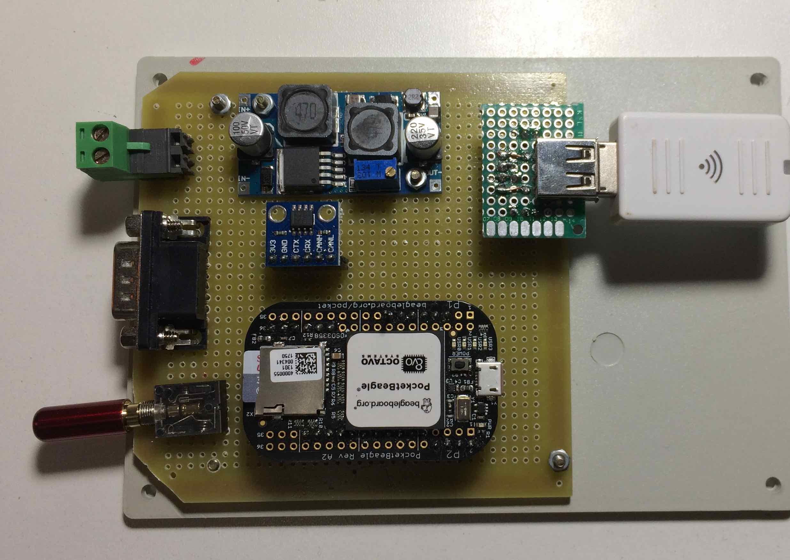
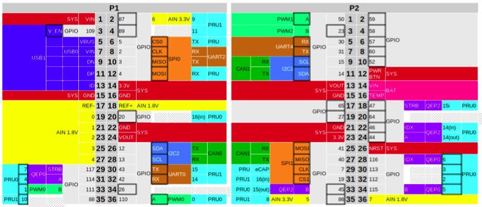

# 1. Computador de bordo 

`Documentos/GitHub/Computador-de-bordo`

Escolheu-se para o computador de bordo do BRElétrico o minicomputador *Beagle Bone*. A sua escolha se baseou no fato de ter uma arquitetura apropriado para sistemas embarcadas baseado em num ARM, ter além do processador principal, dois *Programmable Real-time Unit (PRU)* que podem ser usados para alguma necessidade de processamento dedicado e dois controladores CAN já incorporados na sua placa.

Há diversas versões do Beagle Bone. Um dos mais populares é o *Beagle Bone Black (BBB)* que foi a primeira versão usado neste desenvolvimento.

BBB tem uma interface HDMI, porta ethernet, porta USB e já vem com Linux embarcada e toda estrutura de software para habilita-lo como servidor com toda funcionalidade TCP-IP internet inerente do Linux. A figura a seguir mostra o diagrama do bloco do computador de bordo com display HDMI no painel do veículo e as redes  CAN ligado aos módulos.  


Entretanto, há uma versão mais nova que foi lançada recentemente que é mais compacto (e barato). O PocketBeagle, tem toda a funcionalidade do BBB, mas diversos conectores físicos dos interfaces da BBB foram retiradas e também foi retidada a interface HDMI. 

Para implementar a proposta foi necessário ligar um transciever CAN para  adequar os sinais cmos do Beagle ao padrão do barramento CAN. Este módulo é alimentado com 3.3V podendo ser diretamente ligado no barramento de expansão do Beagle.

O Beagle funcionará como ponte entre as duas redes CAN e a rede TCP-IP. A partir da rede TCP-IP pode-se ter acesso ao Beagle permitindo a sua monitoração remoto ou re-programação.

A primeira rede Can (Can0) estará ligado aos subsistemas críticos do veículo elétrica, fazendo o monitoramento do banco do bateria, o motor de tração e outros subsistemas que precisam comunicar entre se neste barramento mas rápido. 

A segunda rede (Can1) permitirá a comunicação entre o modulo de medição de velocidade e temperatura, o módulo de sinalização e luzes e demais módulos que não são críticos ao funcionamento do veículo. A comunicação destes útimo barramento pode ter uma velocidade menor que o primeiro.

A implementação deste sistema foi feito com um PocketBeagle e um modulo conversor CAN baseado no transciever SN65HVD230, conforme mostrado na foto a seguir:




## 2.1 Configurando o PocketBealge

O primeiro passo é configurar o hardware do PocketBeagle para a proposta.
O PocketBeagle pode ser accessado na USB pelo comando:
 
`ssh debian@192.168.6.2`  ou `ssh debian@beaglebone.local` 

e a senha padrão do Beagle é `temppwd` 

Os pinos no barramento de acesso do PocketBeagle podem ser configurados para dar acesso a várias funcionalidades do computador. 

A dificuldade consiste no fato de o Beagle ter um sistemática de mapeamento de hardware no sistema operacional Linux específica, diferente dos computadores convencionais. O Beagle é um computador numa única placa que usa o processador com arquitetura ARM. Por conta dos inúmeros sistemas baseados no arquitetura ARM que surgiram para sistemas embarcadas, houve uma modificação no Kernel do Linux para dar conta a especificidades destes sistemas.

No sistema operacional Linux  convencional as especificidades do hardware são de certa forma incorporadas no Kernel, mas este sistemática se mostrou impraticável com as placas ARM. Por isso foi introduzido a estrutura de Device Tree para que o computador Beagle saiba qual hardware e periféricos estão fisicamente instalados na placa. Veja o artigo de Mateus Gagliardi: Introdução ao uso de Device Tree e Device Tree Overlay em Sistemas Linux Embarcado. 2015. <https://www.embarcados.com.br/device-tree-linux-embarcado/>

No caso do Beagle essa estrutura de Device Tree tem que dar conta para definir quais pinos serão usados do hardware, pois Beagle tem portas genéricas para entrada e saída de dados (GPIO), uma porta analógica (ADC), PWM, UART, SPI e I2C pinos, e estes pinos podem ser configurados para diversos usos. No nosso caso específico, as duas controladoras CAN usam alguns dos pinos da SPI e do I2C como entrada e saída dos sinais CAN. 

Este roteiro é uma adaptação da configuração do BBB no artigo no [https://www.beyondlogic.org/adding-can-to-the-beaglebone-black/](https://www.beyondlogic.org/adding-can-to-the-beaglebone-black/) para o PocketBeagle.

Nos releases dos kernels mais novos a configuração do pinos é melhor documentos. Para ver a versão do kernal pode executar o comando: 

`$ uname --a`

```
Linux beaglebone 4.19.94-ti-r42 #1buster SMP PREEMPT Tue Mar 31 19:38:29 UTC 2020 armv7l GNU/Linux
```

Para verificar se de fato a Can bus está mapeado no kernel pode-se executar o comando 
`$ dmesg | grep can`

A resposta tem que ser algo do tipo: 

```
[    1.047544] c_can_platform 481cc000.can: c_can_platform device registered (regs=5e6dc592, irq=39)
[    1.049113] c_can_platform 481d0000.can: c_can_platform device registered (regs=e2b987c8, irq=40)
[    1.186345] can: controller area network core (rev 20170425 abi 9)
```


O próximo passo é configur as duas portas can0 e can1. 
A figura a seguir mostra os conectores P1 e P2 com as diversas opções dos pinos.



A interface CAN0 pode ser ligado nos pino 26 e 28 do conector P1. 
Nota-se que a interface CAN1 pode ser ligado nos pinos 9,10 ou 25,27.
Escolheu-se ligar os pinos 26 e 28 do P1 para can0 e 26 e 27 do P2 para can1

| Beagle  | con | pino | transciever | pino |
|:-------:|:---:|:----:|:------:|:----:|
| gnd     | P2  | 21   | GND    | 2    |
| 3.3v    | P2  | 23   | 3V3    | 1    | 
| can1 rx | P2  | 25   | CRX    | U1-4 |
| can1 tx | P2  | 27   | CTX    | U1-3 |
| can0 tx | P1  | 26   | CTX    | U2-3 |
| can0 rx | P1  | 28   | CRX    | U2-4 | 


Há um programa de configuração de pinos que permite escolher a funcionalidade do pino e ver seu atual uso.
Por exemplo o seguinte comando lista todas as opções disponíveis para o pino P2.5:
 
`config-pin -l P2.25`

```
Available modes for P2_25 are: default gpio gpio_pu gpio_pd gpio_input spi spi_cs uart can i2c
``` 

Para configurar o pino para acessar a interface can:

`config-pin P2.27 can`

Para finalizar o processe de configuração do hardware temos que iniciar a interface CAN com o seguinte comando: 

` sudo /sbin/ip link set can1 up type can bitrate 500000`

Com isso pode se verificar o status da interface can com os comandos normais de rede do linux que deve mostrar a nova interface can e todos os outros interfaces de comunicação do sistema.

`ifconfig`

Para automatizar o processo de ativação do Can bus no boot ainda falta descobrir como configurar os pinos como interface can durante o boot. 
Uma opção é de colocar dentro do `crontab` uma sequencia de scripts que serão executados durante o boot.  

script de configuração do CAN no arquivo `code/can0_can1_start.sh`

```
#!/bin/bash
echo "Iniciando as configuracoeas dos pinos para a rede CAN..."

config-pin P1.26 can
config-pin P1.28 can
sudo /sbin/ip link set can0 up type can bitrate 250000

config-pin P2.25 can
config-pin P2.27 can
sudo /sbin/ip link set can1 up type can bitrate 250000

echo "Pinos de CAN0 e CAN1 configurados!..."
```

Com isso conseguimos resolver a parte mais difícil até o presente momento que foi a configuração do Beagle para ativar os dois controladores CAN, habilitar o hardware de interfaceamento com os transcievers CAN e configurar a porta de comunicação no linux para conversar com os controladores.

Para testar se os canais CAN estão funcionando, pode fazer o teste com o loopback 
`sudo /sbin/ip link set can0 up type can bitrate 250000 loopback on`


## 2.2. Testando com can-utils

O sistema operacional Linux embarcada no BBB já vem com pacote SocketCan ou can-utils de ferramentas para trabalhar com a rede de comunicação CAN.
 
Este pacote de ferramentas e utilitários permite visualizar, registrar e gerar tráfego de dados do barramento CAN, além de permitir acesso ao barramento CAN via IP sockets entre vários outros funcionalidades. <https://github.com/linux-can/can-utils>

O utiltário candump do SocketCan permite visualizar os dados do barramento de comunicação.

Com o programa cangen é possivel gerar uma saída aleatorio numa porta can. 
Para testar a rede can executa num terminal :

```
debian@beaglebone:~$ cangen can0
```

Num outro terminal executa 

```
debian@beaglebone:~$ candump any -x 
  can0  RX - -  6B9   [8]  EB 3F 68 35 C9 1B DE 56
  can1  TX - -  6B9   [8]  EB 3F 68 35 C9 1B DE 56
  can0  RX - -  37A   [8]  76 4A DF 7A 42 74 85 5C
  can1  TX - -  37A   [8]  76 4A DF 7A 42 74 85 5C
  can0  RX - -  0EA   [1]  DF
  can1  TX - -  0EA   [1]  DF
  can0  RX - -  69D   [8]  0F E2 C0 10 A8 34 8E 2B
  can1  TX - -  69D   [8]  0F E2 C0 10 A8 34 8E 2B
  can0  RX - -  5EF   [1]  1D
  can1  TX - -  5EF   [1]  1D
```


Há uma vasta documentação técnica sobre o uso do SocketCan em sistemas operacionais Linux acessando a porta CAN a partir de programas desenvolvido em C/C++ ou Python.


# 3. Programação do computador de bordo

O computador de bordo tem que monitorar o controlador do motor elétrico e o BMS no barramento CAN de alta prioridade (velocidade).

O computador de bordo (OBC) tem que ser flexivel o bastante para se comunicar com diversos modelos de controladores de motores elétricos e BMS.  

No caso do BRElétrico, temos um motor de CC brushless do fabricante Guandong que tem uma interface CAN. A documentação deste controlador e motor não é dos melhores, mas pelo menos temos a especificação do protocolo CAN usado pelo controlador. 

No projeto da conversão da VAN vamos usar o CVW500 da WEG que também tem uma interface CAN e implementa o protocolo CANOPEN.

## 3.1. Controlador Motor PM BLDC Guandong

Os parametros do Controlador do motor Brushless CC PM BLDC Guandong são mandados por um CAN frame com as seguintes especificações.

Bus rate: 250kbps
A taxa de envio é 40 ms mandando 2 mensagens, ou seja uma mensagem a cada 20 ms. 
O protocolo usa CAN 2.0 com CAN expand frame 29th identifier

A primeira mensagem (*frame*) frame ID code é 0x10088A9E.
O dados são os seguintes:


| Location | data name           |  explain   |
|:--------:|:-------------------:|:---------:|
| BYTE1    | voltage low byte    | 0.1 V/bit offset: -10000 range: 0~500v|
| BYTE2    | voltage high byte   |
| BYTE3    | currente low byte   | 0.1 A/bit offset: -10000 range -500A~500A |
| BYTE4    | currente high byte  |
| BYTE5    | controller temperature | 1℃/bit offset: 40C limit: 0~100℃ |
| BYTE6    | running state |
| BYTE7    | fault code low byte  |
| BYTE8    | fault code high byte |

O BYTE 6 com o Running status tem o seguinte formato: 


| BIT7 | BIT6 | BIT5 | BIT4 | BIT3 | BIT2 | BIT1 | BIT0 | 
|:----:|:----:|:----:|:----:|:----:|:----:|:----:|:----:|
| reserved | ready for | reserved | reserved | stop | brake | backward | forward|


O código de erro no BYTE 7 e 8 (*Fault code instruction*) tem os seguintes formatos 

| BIT7 | BIT6 | BIT5 | BIT4 | BIT3 | BIT2 | BIT1 | BIT0 | 
|:----:|:----:|:----:|:----:|:----:|:----:|:----:|:----:|
| 0 | ERR7| ERR6 | ERR5 | ERR4 | ERR3 | ERR2 | ERR1 |
| 75℃ | BMS | over speed | over heating | over voltage | under voltage | over current | IGBT |


A segunda mensagem (*frame ID code*) tem como código  0x10098A9E. 
Os dados mostram a operação do motor da seguinte maneira:

| DATA LOCATION | DATA NAME | explain |
|---------------|-----------|---------|
| BYTE1 | motor speed low byte | 1rpm,  offset： 0, range：0 ～10000 |
| BYTE2 | motor speed high byte | |
| BYTE3 | mileage low byte	| 0.1	kilometer, offset：0, range：0～30000| 
|BYTE4	| mileage high byte |	
|BYTE5	| motor torque low byte	 | 0.1NM, offset：-10000, range：-1000～1000 |
|BYTE6	| motor torque high byte |
|BYTE7	| reserved|	
|BYTE8	| reserved|
	
```
0x10088A9E = PDU format 0x08, specific 0x8A, PGN = 2186, source adress = 0x9E
0x10098A9E = PDU format 0x09, specific 0x8A, PGN = 2442, source adress = 0x9E
```

Para facilitar o desenvolvimento do OBC fizemos uma programa de simulação da comunicação do controlador PM BLDC Guandong em python que está no diretório:

`code_simulador_motor/simularo_motor.py`

[O link para o simulador] (../Computador-de-bordo/code_simulador_motor/simulador_motor.py)

## 3.2. BMS Battery Management System

`src/BrEletrica/Barramento_Alta_Can.Barramento_Alta_README.md`

Com o osciloscópio mediu-se o sinal no barramento CAN e descobriu-se que a velocidade de comunicação do barramento era de 250khz. 
Funcionamento do Modulo concentrador de comunicação.
Sistema composto por 4 modulos de 16 celular LIFEPO4, ligado por meio de uma barramento próprio, passando alimentação e sinais para o modulo concentrador. Este modulo concentrador tem duas portas CAN. Uma porta para  o Battery Charger e outro avulso. 

Foi feito o teste no 14/05/2020 com Arduino e Can sheild da sparkfun. 
Ligou somente um modulo de batterias (tensão +-40 volts) e o display do BMS. 
Sem ligar o sparkfun o barramento mostra uma atividade muito intensa no osciloscópio. Assim que coloca o sparkfun, no barramento aparece somente vem um pacote de dados a cada 2 segundos.

Usou programa 
`CAN Read Demo for the SparkFun CAN Bus Shield.`
Da biblioteca de CAN do Arduino Shield. Somente configurou o programa para 250khz e a porta serial 57200 bps. 


Quando liga o concentrador somente com um modulo e o display e o Arduino CAN Shield.  

Primeiro teste arduino 

```
CAN Read - Testing receival of CAN Bus message
CAN Init ok
ID: 601, Data: 89 99 00 0F 01 00 00 00 
ID: 33C, Data: 80 00 00 00 00 00 00 00 
ID: 601, Data: 89 99 00 0F 01 00 00 00 
ID: 33C, Data: 80 00 00 00 00 00 00 00 
ID: 601, Data: 89 99 00 0F 01 00 00 00 
ID: 33C, Data: 80 00 00 00 00 00 00 00 
ID: 601, Data: 89 99 00 0F 01 00 00 00 

```

Quarta teste

```
CAN Read - Testing receival of CAN Bus message
CAN Init ok
ID: 601, Data: 89 99 00 0F 00 00 00 00 
ID: 33C, Data: 80 00 00 00 00 00 00 00 
ID: 601, Data: 89 99 00 0F 00 00 00 00 
ID: 33C, Data: 80 00 00 00 00 00 00 00 
ID: 601, Data: 89 99 00 0F 00 00 00 00 
ID: 33C, Data: 80 00 00 00 00 00 00 00 
ID: 601, Data: 89 99 00 0F 00 00 00 00 
ID: 33C, Data: 80 00 00 00 00 00 00 00 
ID: 601, Data: 89 99 00 0F 00 00 00 00 
ID: 33C, Data: 80 00 00 00 00 00 00 00 
ID: 601, Data: 89 99 00 0F 00 00 00 00 
ID: 33C, Data: 80 00 00 00 00 00 00 00 
ID: 601, Data: 89 99 00 0F 01 00 00 00 
ID: 33C, Data: 80 00 00 00 00 00 00 00 
ID: 601, Data: 89 99 00 0F 01 00 00 00 
ID: 33C, Data: 80 00 00 00 00 00 00 00 
ID: 601, Data: 89 99 00 0F 01 00 00 00 
```

Testando com candump dia 04 junho 2020 ligando o BMS

```
breletrico@AcerNetbook:~$ candump can0 -a -c
  can0  1806E5F4   [8]  09 99 00 0F 00 00 00 00   '........'
  can0  0CF1EFF4   [8]  00 00 00 00 00 00 00 00   '........'
  can0  1806E5F4   [8]  09 99 00 0F 00 00 00 00   '........'
  can0  0CF1EFF4   [8]  00 00 00 00 00 00 00 00   '........'
  can0  1806E5F4   [8]  09 99 00 0F 00 00 00 00   '........'
  can0  0CF1EFF4   [8]  00 00 00 00 00 00 00 00   '........'
  can0  1806E5F4   [8]  09 99 00 0F 00 00 00 00   '........'
  can0  0CF1EFF4   [8]  00 00 00 00 00 00 00 00   '........'
  can0  1806E5F4   [8]  09 99 00 0F 00 00 00 00   '........'
  can0  0CF1EFF4   [8]  00 00 00 00 00 00 00 00   '........'
  can0  1806E5F4   [8]  09 99 00 0F 00 00 00 00   '........'
  can0  0CF1EFF4   [8]  00 00 00 00 00 00 00 00   '........'
  can0  1806E5F4   [8]  09 99 00 0F 01 00 00 00   '........'
  can0  0CF1EFF4   [8]  00 00 00 00 00 00 00 00   '........'
  can0  1806E5F4   [8]  09 99 00 0F 01 00 00 00   '........'
  can0  0CF1EFF4   [8]  00 00 00 00 00 00 00 00   '........'
  can0  1806E5F4   [8]  09 99 00 0F 01 00 00 00   '........'
  can0  0CF1EFF4   [8]  00 00 00 00 00 00 00 00   '........'
  can0  1806E5F4   [8]  09 99 00 0F 01 00 00 00   '........'
  can0  0CF1EFF4   [8]  00 00 00 00 00 00 00 00   '........'
  can0  1806E5F4   [8]  09 99 00 0F 01 00 00 00   '........'
  can0  0CF1EFF4   [8]  00 00 00 00 00 00 00 00   '........'
  can0  1806E5F4   [8]  09 99 00 0F 01 00 00 00   '........'
  can0  0CF1EFF4   [8]  00 00 00 00 00 00 00 00   '........'
  can0  1806E5F4   [8]  09 99 00 0F 01 00 00 00   '........'
  can0  0CF1EFF4   [8]  00 00 00 00 00 00 00 00   '........'
```

Teste com timestamp e Chaveado a bateria on/off

`0x1806E5F4 = PDU format 0x06, specific 0xE5, PGN = 1765, source adress = 0xF4`
`0x0CF1EFF4 = PDU format 0xF1 specific 0xEF  PGN = 61935, source address = 0xF4`


## 3.3. Protocolo J1939

O J1939 aproveita o identificador do 29 bits do CAN para passar informações específicas do tipo de comunicação. 

A estrutura de bits da identificação tem o seguinte formato.

| priority | Extendes data page | data page | pdu format | pdu specific | source adddres |
|:------:|:-----:|:----:|--------|--------|--------|
| 3 bits | 1 bit | 1bit | 8 bits | 8 bits | 8 bits |


Os campos PDU format e PDU specific constrinuem o valor que será atribuído ao PGN da mensagem e também definiem o modo como as mensagens são enereçadas na linha

| PDU format | descriçao | PDU specific | 
|:-----:|:----:|:------:|
| 0 - 0xEF ou 0-239 | transmite para endereco indicado no PDU specific | endereco|
| 0xF0 - 0xFF ou 240-255 | broadcast | Indice de referencia do Group Extension |  

A formatação do PGN é (PDU format) * 0x100 + PDU specific  


Por exemplo.

Vamos colocar usar as mensagens do J1939 para mandar os dados do BMS e do Controlador do Motor para o computador de bordo

| Mensagem         | Origem | Destino | PGN   | descrição  |
|:----------------:|:------:|:-------:|:-----:|:----------:|
| Tensao bateria   | BMS    | todos   |  xx   |            |
| Corrente bateria | BMS    | todos   |
| Rotaçao motor    | Controlador motor | 


Máquina de estado do computador de bordo. 
Monitorando barramento de alta velocidade

- Corrente e tensão do bateria
- Estado do controlador do motor
 
Monitorando barramento de baixa velocidade

- Velocidade, temperatura
- Tensão secundárias

Visualizando dados no display.


Para programação em Python Veja artigo de Bruno Oliveira 2017 - Aplicação rede CAN com BBB e Python <https://www.embarcados.com.br/can-com-beaglebone-black-e-python/>

[1] Borth TF. Analisando os Impactos do Uso do Protocolo Can FD em Aplicações Automotivas – Estudo de Caso. UNIVERSIDADE FEDERAL DO RIO GRANDE DO SUL, 2016.


# 4. Protocolo CANOPEN

O motor da WEG VVW500 usa Canopen @ 250000bps e identificação de 11bits.

# Bibliografia
 

4) Ribeiro A do N, Meneghin P, Els RH van. Developing technology for a Brazilian hybrid electric mini car. 2nd Lat. Am. Conf. Sustain. Dev. Energy, Water Environ. Syst., 2020, p. 1–10. 
[link artigo](http://fga.unb.br/rudi.van/galeria/arrigo-alex-lasdewes20-fp-161.pdf)

[Volta](../README.md)
